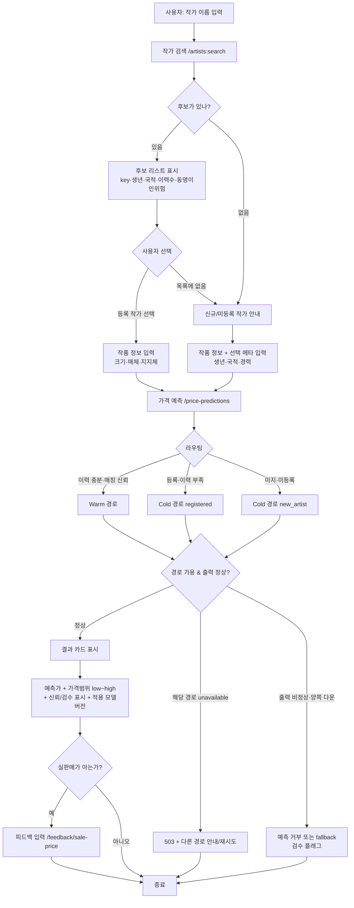
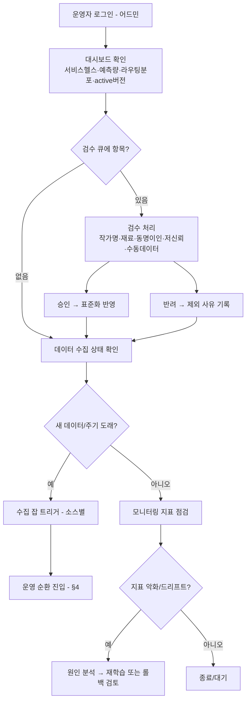
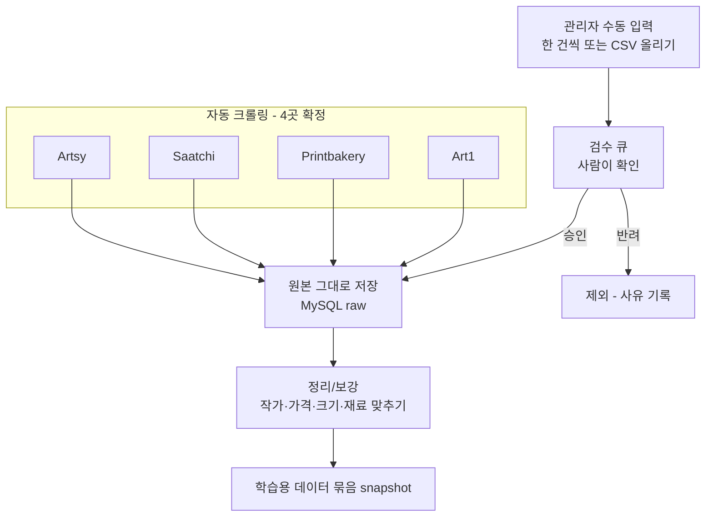
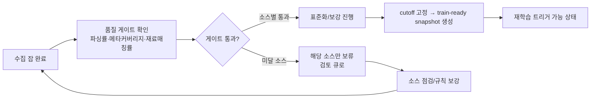
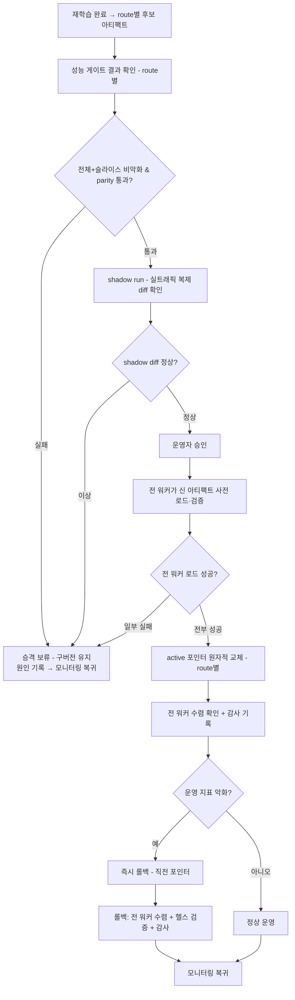
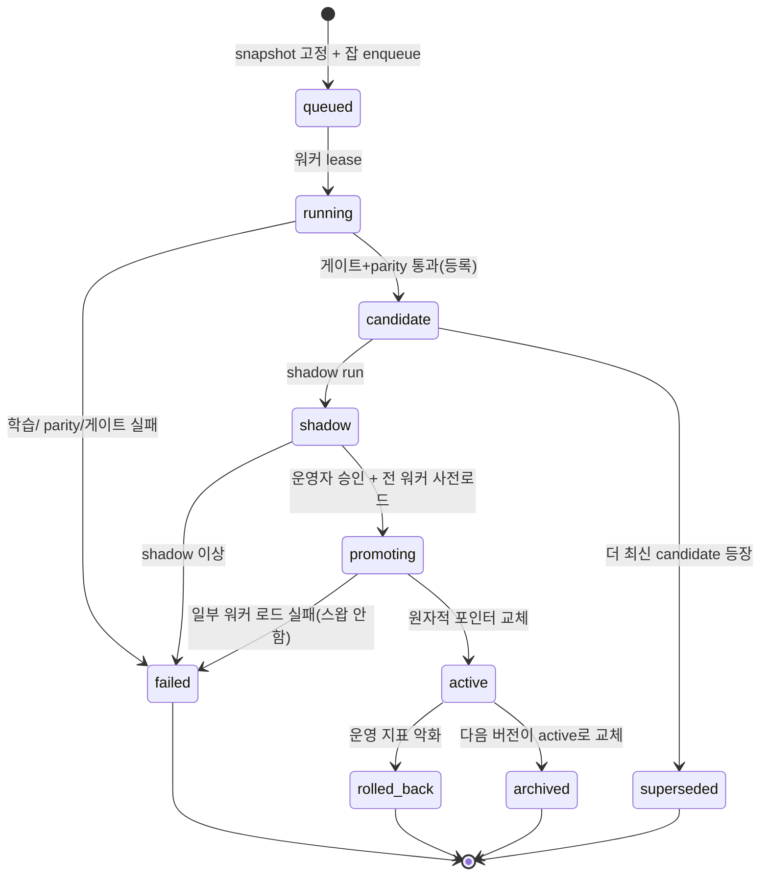

# Track6 가격예측 — 운영/사용자 시나리오 & 순환 구조

- 작성일: 2026-06-23
- 성격: **모델 버전에 독립적인** 시나리오·순환 구조 정의(순서도/구조도 중심).
- 전제: **모델(Warm/Cold)은 아직 미확정**이다. 따라서 특정 모델 성능에 의존하지 않는 **시스템의 외형(시나리오)과 순환(루프)** 을 먼저 고정한다. 모델은 "순환 안에서 교체되는 부품"으로 다룬다.
- **부모 문서와 전제 맞추기(코덱스 P2-7)**: 마스터 아키텍처는 설명을 쉽게 하려고 "모델 확정"을 가정하지만, **실제로는 아직 실험 중**이다. 이 문서가 맞다 — 마스터의 "확정 전제"는 *"모델이 바뀌어도 이 순환 구조가 그대로 받아내므로, 어떤 모델 버전이든 작동은 같다"* 로 읽으면 된다. **모델이 무엇이든 항상 지켜야 하는 마스터 규칙**: strict-Cold·불변 아티팩트·route(경로)별 독립 버전/포인터·전 워커 사전로드 후 승격·성능 게이트·parity·소스 추적성. (마스터 문서 §1에도 같은 문구를 넣었다.)
- 상위 문서: `2026-06-23-track6-operational-platform-master-architecture.md`(4-플레인 구조), `2026-06-22-track6-operational-serving-design.md`(서빙 내부).
- 다이어그램은 Mermaid(순서도) + ASCII 링(순환)으로 표기.

---

## 0. 한눈에 — 네 가지 그림의 관계

이 문서는 4개의 그림을 정의한다. 둘은 **선형 시나리오**(누가 무엇을 하나), 둘은 **순환 구조**(무엇이 반복되나).

```
   [사용자 시나리오] ──요청/피드백──►  서비스  ──예측로그/실판매가──►  [운영 순환]
                                                                         │
                                                                         ▼
   [운영 시나리오] ──검수·트리거·승격──►  플랫폼  ◄──새 모델 버전──  [모델 순환]
```

- **사용자 시나리오**(§1): 끝단 사용자가 가격을 얻고 피드백을 남기는 흐름.
- **운영 시나리오**(§2): 운영자가 **데이터 수집(크롤링 4곳 + 수동)**·검수·학습·승격을 사람 손으로 운영하는 흐름.
- **모델 순환**(§3): 데이터→학습→평가→게이트→레지스트리→서빙→피드백→데이터로 닫히는 모델 생애 루프.
- **운영 순환**(§4): 주기 수집→표준화→snapshot→재학습 트리거→모니터링→다음 주기로 닫히는 운영 루프.
- **두 순환의 맞물림**(§5): 모델 순환과 운영 순환이 어디서 만나는가.

---

## 1. 사용자 시나리오 (Usage Scenario)

끝단 사용자(작가/갤러리/평가자)가 작품 가격을 조회한다. **모델이 무엇이든 사용자 경험은 동일**해야 한다.

### 1.1 메인 흐름 — 가격 조회



**핵심 규칙(모델 무관)**:
- 사용자는 **작가를 먼저 검색해 선택**한다(자유 텍스트로 바로 예측 안 함).
- 미등록 작가도 **정상 상태에서는 예측 가능**(Cold new_artist). 메타는 선택 입력, 미입력 허용. 단 **해당 경로 unavailable·양쪽 모델 다운·출력 비정상+fallback 불가** 시에는 거부될 수 있다(§1.2).
- 결과는 **점 예측 + 범위 + 신뢰/검수 신호 + 모델 버전**을 함께 보여준다(단일 숫자만 주지 않음).
- 실판매가 피드백은 **선택**이지만, 들어오면 **검수·거래 확정 여부·기준시점(cutoff) 검사를 거쳐**(§3) 운영 순환으로 들어간다(받은 그대로 바로 학습에 쓰지 않는다).

### 1.2 분기 시나리오 (코덱스 P2-1 보강)

| 상황 | 사용자 경험 |
|---|---|
| 동명이인 위험 높음 | 후보 재선택 요청, Warm 차단 → 검수 플래그 |
| 등록됐지만 이력 부족 | 정상 예측 + "낮은 신뢰" 표시(cold_registered) |
| 신규 작가, 메타 결측 | 결측 상태로 예측 + "메타 입력 시 정확도↑" 안내 |
| 한쪽 모델 다운 | 해당 경로 503/unavailable, 다른 경로는 정상 |
| **양쪽 모델 다운** | 서비스 unhealthy, 예측 거부 + 안내 |
| **출력 비정상(NaN/음수/범위역전)** | fallback(Warm 작가통계 median / Cold base q50) + 검수 플래그, 불가 시 거부 |
| **잘못된 예측에 피드백** | prediction_id 매칭 필수, outlier·불일치는 플래그(학습 필터) |

---

## 2. 운영 시나리오 (Operational Scenario)

운영자가 플랫폼을 사람 손으로 운영한다. **모델이 아직 안 정해진 단계에서는, 이 흐름이 모델 바뀜을 받아낸다.**

### 2.1 일상 운영 — 검수 & 트리거



### 2.2 데이터 수집 — 크롤링 4곳 + 관리자 수동

데이터는 두 길로 들어온다: ①정해진 **4개 사이트 자동 크롤링**, ②**관리자가 직접 넣는 수동 입력**. 둘 다 **같은 원본 저장소(raw)로 들어와 같은 검사·같은 정리**를 받는다.



**핵심 규칙**:
- 크롤링 사이트는 **Artsy / Saatchi / Printbakery / Art1 4곳으로 확정**. 각 사이트는 따로따로 모은다(한 곳이 막혀도 나머지는 그대로 진행).
- 관리자 수동 입력도 **샛길이 아니다.** 검수 큐(사람이 확인하는 대기열)를 거쳐 같은 raw에 `source=manual`로 들어오고, **같은 정리·같은 품질검사**를 받는다(어디서 왔는지·날짜·넣은 사람 기록).
- 원본(raw)은 **손대지 않고 그대로 보관**한다. 정리·가공은 그 다음 단계에서만 한다.

### 2.3 신규 데이터 → 학습데이터 전환 (운영자 관점)



> 미달 소스는 보류 후 보강→재수집으로 **루프가 닫힌다**(A로 복귀). 통과 소스는 진행을 막지 않는다.

### 2.4 모델 승격/롤백 (운영자 관점)

**승격 순서는 안전에 아주 민감하다**(코덱스 P1-1: 포인터를 바꾸기 *전에* 모든 워커가 새 모델을 미리 불러와 확인). 마스터 §6과 같다.



**핵심 규칙(모델 무관)**:
- 어떤 모델이든 **게이트 → shadow → 승인 → 전 워커 사전로드·검증 → 원자적 포인터 교체 → 수렴확인·감사**의 동일 관문. **로드 실패 워커가 있으면 스왑 안 함**(부분 롤아웃 금지).
- **route별 독립**(코덱스 P1-4): Warm/Cold는 각자 게이트·아티팩트·포인터. 좋은 Warm이 나쁜 Cold를 끌고 가지 않는다.
- 승격/롤백은 **포인터 교체만**(아티팩트 불변). 롤백도 동일 순서(전 워커 수렴+헬스+감사) 후 모니터링 복귀.
- **승격 전제(코덱스 P1-6)**: "나쁜 모델은 못 올라간다"는 **게이트 정책·슬라이스·기준선·롤백 기준이 설정됐을 때만** 성립. 이 설정 전에는 **승격 자체를 차단**(미설정 = 자동 보류). 미확정 모델 단계의 안전은 *관문이 있다*가 아니라 *관문이 강제된다*에서 온다.

---

## 3. 모델 순환 구조 (Model Lifecycle Cycle)

모델 한 버전의 생애. **닫힌 루프** — 서빙 결과가 다시 데이터가 되어 다음 버전을 만든다.

```
            ┌────────────────────────────────────────────────────┐
            │                                                    │
            ▼                                                    │
   ┌─────────────────┐      ┌─────────────────┐      ┌─────────────────┐
   │ 1. 학습 데이터    │─────►│ 2. 학습          │─────►│ 3. 평가          │
   │  (snapshot)      │      │  Warm/Cold       │      │  fixed test     │
   │                  │      │  (버전 미확정)    │      │  + 슬라이스      │
   └─────────────────┘      └─────────────────┘      └────────┬────────┘
            ▲                                                  │
            │                                                  ▼
   ┌────────┴────────┐      ┌─────────────────┐      ┌─────────────────┐
   │ 8. 피드백/로그    │◄─────│ 7. 서빙          │◄─────│ 4. parity+게이트 │
   │  실판매가·예측    │      │  active 버전     │      │  비악화 검증     │
   │  → 새 학습데이터  │      │                  │      │                 │
   └─────────────────┘      └────────┬────────┘      └────────┬────────┘
                                     ▲                        │
                                     │                        ▼
                            ┌────────┴────────┐      ┌─────────────────┐
                            │ 6. 승격          │◄─────│ 5. 레지스트리    │
                            │  포인터 교체     │      │  불변 버전 등록  │
                            │  (또는 롤백)     │      │  candidate      │
                            └─────────────────┘      └─────────────────┘
```

| 단계 | 무엇 | 산출 |
|---|---|---|
| 1 학습데이터 | train-ready snapshot(cutoff 고정) | snapshot_id |
| 2 학습 | **route별** Warm/Cold 학습(현재 미확정, 실험 중) | route별 후보 번들 |
| 3 평가 | fixed test + 슬라이스(warm/cold/고가/메타결측) | 지표 |
| 4 parity+게이트 | 실험=predictor diff 0, 구버전 비악화 (**route별 독립**) | pass/fail |
| 5 레지스트리 | 통과 시 불변 아티팩트 등록(candidate) | artifact_id |
| 6 승격 | shadow → 전 워커 사전로드 → 원자적 포인터 교체(or 롤백) | active_pointer(route별) |
| 7 서빙 | active 버전으로 예측 (strict-Cold 강제) | 예측 결과 |
| 8 피드백 | 예측 로그 + 실판매가 | 원시 피드백 |
| **8b 피드백 걸러내기** | **거래 확정 여부(sold_at)·이상치 제거·사람 검수·기준시점(cutoff) 확인** | 학습에 쓸 정답 |

**루프가 닫히는 지점(코덱스 P1-2 보강)**: 8 → **8b 걸러내기** → 1. 서빙에서 나온 실판매가·예측 기록은 **받은 그대로 학습에 안 들어간다.** 8b에서 ①`sold_at` 확정(실제로 팔린 것만) ②이상치 제외 ③사람 검수 통과 ④**기준시점(cutoff) 이후 정답·예측값이 학습에 새어 들어가지 않게 차단** 한 것만 다음 데이터 묶음에 넣는다. (우리가 예측한 값이 다시 정답처럼 학습에 들어가는 자기 오염은 금지.)

**route별 독립(코덱스 P1-4)**: 2·4·5·6은 Warm/Cold 각각 돈다. 한 route만 게이트 통과해 승격 가능.

**strict-Cold(코덱스 P1-5)**: 7 서빙에서 Cold 경로는 **같은 작가의 과거 가격을 찾아보면 안 된다** + `cold_registered`도 비교용 데이터에서 그 작가를 빼고 본다(leave-one-artist-out = 같은 작가 한 명을 빼고 비교). 절대 규칙(마스터 §1.5).

**실패 전이(코덱스 P2-6, 위 다이어그램은 성공경로 요약)**: 각 단계는 실패 출구를 가진다 — 2 학습 실패→재시도/중단, 4 parity·게이트 실패→**candidate 미등록, 구버전 유지**, 6 shadow 실패/워커 로드 실패→**스왑 안 함**, 6 승격 후 악화→**롤백**. 새 candidate가 나오면 직전 미승격 candidate는 `superseded`.

**모델 미확정의 의미**: 단계 2가 아직 흔들려도, 1·3·4·5·6·7·8·8b의 **관문과 배선은 고정**이라 어느 후보든 같은 루프를 돈다. 단 §2.4 단서대로 **합격 기준이 먼저 정해져야 6 승격이 열린다**.

---

## 4. 운영 순환 구조 (Operational Cycle)

플랫폼이 주기적으로 도는 운영 루프. 모델 순환보다 **바깥쪽 큰 바퀴** — 데이터를 계속 새것으로 유지하고, 재학습을 시작하게 한다.

```
        ┌──────────────────────────────────────────────────────────┐
        │                                                          │
        ▼                                                          │
 ┌──────────────┐    ┌──────────────┐    ┌──────────────┐    ┌──────────────┐
 │ A. 주기 트리거 │───►│ B. 소스별 수집 │───►│ C. raw 적재   │───►│ D. 표준화/보강 │
 │  스케줄/이벤트 │    │  4개 사이트   │    │  MySQL raw   │    │  L1~L4       │
 └──────────────┘    └──────────────┘    └──────────────┘    └──────┬───────┘
        ▲                                                           │
        │                                                           ▼
 ┌──────┴───────┐    ┌──────────────┐    ┌──────────────┐    ┌──────────────┐
 │ H. 다음 주기  │◄───│ G. 모니터링   │◄───│ F. 재학습 시작 │◄───│ E. 품질게이트 │
 │  대기/예약    │    │  드리프트·지표 │    │  → 모델순환   │    │  + snapshot  │
 └──────────────┘    └──────────────┘    └──────────────┘    └──────────────┘
```

| 단계 | 무엇 | 비고 |
|---|---|---|
| A 트리거 | 고정 주기 도래 / 소스 갱신 이벤트 / 운영자 수동 | 스케줄러 리더 1개 |
| B 수집 | 자동 크롤링 4곳(Artsy/Saatchi/Printbakery/Art1) 따로 + 관리자 수동, 새로 바뀐 것만(§2.2) | durable 잡 |
| C raw 적재 | run별 원본 보존 + 디듑 | 불변 raw |
| D 표준화/보강 | 작가키·가격·크기·매체 표준화 + 메타 | L1~L4 |
| E 게이트+snapshot | 품질 통과분만 cutoff 고정 | train-ready |
| F 재학습 시작 | snapshot 준비 → **모델 순환(§3) 시작** | 두 순환 맞물림 |
| G 모니터링 | 라우팅·예측분포·드리프트·피드백 누적 | |
| H 다음 주기 | 대기/예약 → A로 | 루프 닫힘 |

**루프가 닫히는 지점**: H → A. 운영 순환은 **시간 기반**(주기)으로 계속 돈다.

---

## 5. 두 순환의 맞물림 (Interlock)

운영 순환(바깥 바퀴)이 모델 순환(안쪽 바퀴)을 **단계 F에서 돌린다.** 두 바퀴는 톱니처럼 물린다.

```
   운영 순환 (시간 주기 바퀴)                모델 순환 (버전 생애 바퀴)
   ┌─────────────────────────┐
   │  A→B→C→D→E              │
   │           │             │
   │           ▼             │
   │   F. snapshot 준비 ──────┼────► [모델순환 1. 학습데이터]
   │                         │              │
   │                         │              ▼  2~6 (학습·평가·게이트·승격)
   │   G. 모니터링 ◄──────────┼────── [모델순환 7. 서빙]
   │           │             │              │
   │           ▼             │              ▼
   │   H→A (다음 주기)        │      [모델순환 8. 피드백] ──┐
   └─────────────────────────┘                            │
              ▲                                            │
              └──────────── 피드백이 다음 snapshot 입력 ────┘
```

- **맞물림 1 (F → 모델순환 1)**: 운영 순환이 새 snapshot을 내면 모델 순환의 학습이 시작된다.
- **맞물림 2 (모델순환 7·8 → 운영순환 G)**: 서빙 예측과 실판매가 피드백이 운영 순환의 모니터링·다음 데이터로 돌아온다.
- **속도 차이**: 운영 순환은 **자주**(예: 주/월 주기) 돌고, 모델 순환은 **게이트를 통과할 때만** 한 칸 전진(승격). 데이터는 매 주기 신선해지지만 모델 버전은 검증됐을 때만 바뀐다.
- **모델 미확정 단계의 안전장치**: 모델 순환의 단계 2가 실험 중이어도, 게이트(4)와 shadow(6) 관문이 **검증 안 된 모델의 승격을 막는다(단 §2.4대로 합격 기준이 먼저 정해진 경우).** 운영 순환은 모델과 무관하게 계속 데이터를 쌓아 둔다 → 모델이 확정되면 즉시 좋은 snapshot으로 학습 가능.

### 5.1 동시성 제어 (코덱스 P1-3 — 빠른 루프가 stale/중복 사이클을 유발하지 않게)

운영 순환이 모델 순환보다 자주 돌므로, **여러 snapshot·여러 후보가 동시에 떠다닐 수 있다.** 통제 규칙:

- **snapshot 고정(pinning)**: 한 학습 사이클은 시작 시 **하나의 `snapshot_id`에 고정**된다. 도중 새 snapshot이 나와도 그 사이클은 고정 snapshot으로 끝낸다(스왑 중간 입력 변경 금지).
- **후보 상태 + durable 잡**: 학습은 마스터 §3.7 `job`으로 실행(멱등키·리스). 후보는 아래 상태를 가진다.
- **최신만 승격(latest-eligible-only)**: 게이트 통과 candidate가 여러 개여도 **가장 최신(최신 snapshot 기반)만 승격 후보**. 구 candidate는 자동 `superseded`. 동시에 두 개가 active 포인터를 다투지 않는다.
- **같은 경로는 한 번에 하나만**: 같은 route(경로)의 승격은 한 번에 하나만 진행(advisory lock = 줄 세우기 잠금). Warm·Cold는 서로 동시에 가능.

후보(candidate) 생애 상태 머신:



---

## 6. 이 문서가 고정하는 것 / 안 하는 것

**고정(모델과 무관하게 지금 확정 가능)**
- 사용자가 가격을 얻는 흐름과 화면 데이터(§1).
- 데이터 수집 길 — **크롤링 4곳(Artsy/Saatchi/Printbakery/Art1) + 관리자 수동** 이 같은 raw로 모이는 흐름(§2.2).
- 운영자가 검수·재학습 시작·승격하는 흐름(§2).
- 모델 한 버전이 도는 생애 루프와 관문(§3).
- 데이터가 주기적으로 신선해지는 운영 루프(§4).
- 두 루프가 맞물리는 방식과 속도 차이(§5).

**안 함(모델 확정 후 / 별도 문서)**
- 어떤 Warm/Cold 알고리즘·하이퍼파라미터를 쓸지(모델 순환 단계 2의 내부).
- 구체 MySQL 스키마 DDL(별도 정본 문서).
- API 필드 상세(기존 API 명세).
- 성능 게이트의 정확한 합격 기준값(모델이 정해질 때 수치 고정).
