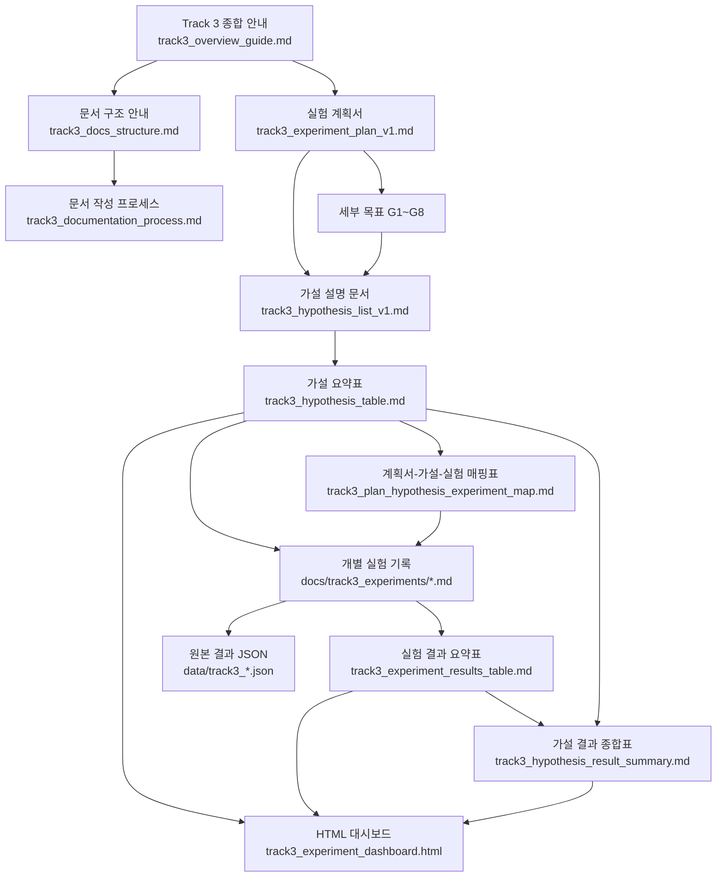
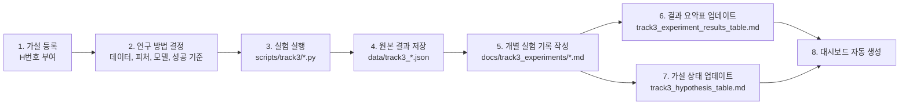

# Track 3 문서 구조 순서도

- 목적:
- Track 3 실험 문서가 어떤 순서와 역할로 연결되는지 상사 보고용으로 설명하기 위한 문서
- 핵심 메시지:
- 실험은 `가설 -> 실험 방법 -> 실행 -> 검증 -> 결론` 순서로 진행함
- 문서는 이 흐름을 따라 분리해서 관리함
- HTML 대시보드는 Markdown 기준 문서를 읽어 자동 생성함

## 1. 전체 문서 구조



## 2. 실험 1건이 문서에 남는 흐름



## 3. 각 문서의 역할

| 구분 | 문서 | 역할 |
|---|---|---|
| 전체 입구 | `track3_overview_guide.md` | 처음 보는 사람이 전체 흐름을 파악 |
| 기준 | `track3_experiment_plan_v1.md` | 데이터, 피처, 평가 지표, 실험 원칙 고정 |
| 구조 | `track3_docs_structure.md` | 어떤 문서가 어떤 역할인지 설명 |
| 프로세스 | `track3_documentation_process.md` | 실험 전후 어떤 문서를 업데이트할지 설명 |
| 가설 설명 | `track3_hypothesis_list_v1.md` | 각 가설의 배경, 질문, 연구 방법, 판단 정리 |
| 가설 상태 | `track3_hypothesis_table.md` | H번호별 현재 상태를 한눈에 관리 |
| 매핑 | `track3_plan_hypothesis_experiment_map.md` | 계획서 단계, 가설, 실제 실험 연결 |
| 개별 기록 | `docs/track3_experiments/*.md` | 실험별 사용 데이터, 피처, 결과, 해석 기록 |
| 결과 표 | `track3_experiment_results_table.md` | 실행된 실험 결과를 표로 요약 |
| 종합 결론 | `track3_hypothesis_result_summary.md` | 가설별 근거 실험과 현재 결론 연결 |
| 원본 수치 | `data/track3_*.json` | 스크립트 실행 결과 원본 보관 |
| 보기용 | `track3_experiment_dashboard.html` | 가설과 실험 결과를 HTML로 확인 |

## 4. 보고 시 설명 문장

- Track 3 문서는 단순 결과 저장이 아니라 `가설 기반 실험 관리 체계`로 구성함
- 먼저 실험 계획서에서 데이터와 평가 기준을 고정함
- 그다음 가설 문서에서 왜 이 실험을 하는지 정의함
- 실제 실험은 개별 기록과 원본 JSON으로 남김
- 실험이 끝나면 가설 상태표와 실험 결과표를 업데이트함
- HTML 대시보드는 이 표들을 읽어 자동 생성되므로 최신 현황을 빠르게 볼 수 있음

## 5. 유지 관리 원칙

- HTML은 직접 수정하지 않음
- 가설이나 결과가 바뀌면 Markdown 기준 문서를 먼저 수정함
- 이후 아래 명령으로 대시보드를 재생성함

```bash
python3 scripts/track3/generate_experiment_dashboard.py
```
