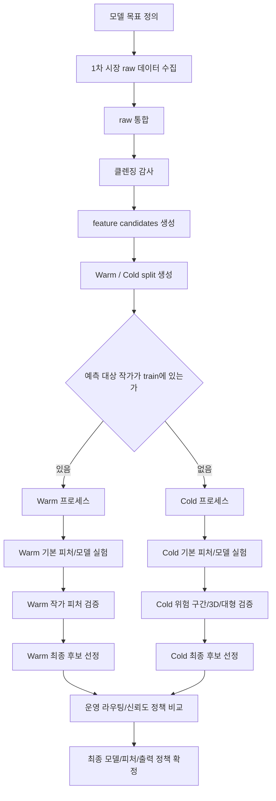

# Track 4 Warm / Cold 분리 실험 프로세스

- 목적: Track 4 모델 실험을 Warm과 Cold로 명확히 나누어 진행하기 위한 기준 문서
- 기준일: 2026-05-15
- 전제: Track 4 클렌징 파이프라인으로 `cleaned_v2`, `feature_candidates`, Warm/Cold split이 생성되어 있어야 함
- 관련 문서:
- `docs/track4_cleaning_pipeline.md`
- `docs/track4_experiment_plan_v1.md`
- `docs/track4_split_report.md`

## 1. 전체 목표

- 최종 목표
- 작품 1건의 정보를 보고 가격을 예측하는 모델 구축
- Track 4에서 확인할 핵심
- 새로 클렌징한 1차 시장 데이터에서도 Warm / Cold를 분리하는 것이 맞는지 확인
- Warm 모델은 기존 작가 정보를 안전하게 활용할 수 있는지 확인
- Cold 모델은 신규 작가 상황에서 어느 수준까지 서비스 가능한지 확인
- Warm / Cold 각각의 입력 피처, 모델, 신뢰도 정책을 따로 정리

## 2. Warm / Cold 정의

| 구분 | 정의 | 모델 선택 기준 | 사용 가능한 정보 | 사용 불가 정보 |
|---|---|---|---|---|
| Warm | 학습 데이터에 이미 등장한 작가의 새 작품 예측 | 예측 대상 `artist_key`가 train에 1건 이상 존재 | 작품 구조 정보, 작가명, 학습 데이터 기준 작가 이력 | 예측 시점 이후 작가 거래/가격 정보 |
| Cold | 학습 데이터에 없는 신규 작가의 작품 예측 | 예측 대상 `artist_key`가 train에 없음 | 작품 구조 정보, 재료, 크기, 3D 여부 등 | 작가명 효과, 작가별 과거 가격 통계 |

## 3. 데이터 기준

| 데이터 | 용도 | Warm / Cold 의미 |
|---|---|---|
| `data/track4_primary_market_cleaned_v2.csv` | 전체 클렌징 결과 보존 | 학습 후보와 제외 row를 모두 포함 |
| `data/track4_primary_market_feature_candidates_v1.csv` | 모델 입력 후보 | 운영 가능 피처 중심 후보 |
| `data/track4_split/track4_train.csv` | 학습 전용 | Warm/Cold 모델 모두 이 파일에서 학습 |
| `data/track4_split/track4_val_warm.csv` | Warm 검증 | train에 존재하는 작가의 holdout 작품 |
| `data/track4_split/track4_val_cold.csv` | Cold 검증 | train에 없는 작가 전체 holdout |
| `data/track4_split/track4_test_warm.csv` | Warm 최종 평가 | train에 존재하는 작가의 최종 확인용 작품 |
| `data/track4_split/track4_test_cold.csv` | Cold 최종 평가 | train에 없는 작가의 최종 확인용 작품 |

## 4. 전체 순서도

## 5. Warm 프로세스

| 순서 | 단계 | 알고자 하는 것 | 실험 방법 | 판단 기준 |
|---:|---|---|---|---|
| W1 | Warm 기준 데이터 확인 | Warm test 작가가 train에 모두 존재하는가 | `track4_train.csv`와 `track4_test_warm.csv`의 `artist_key` 비교 | test_warm 작가가 모두 train에 있으면 진행 |
| W2 | Warm 기본 모델 생성 | 작품 구조 정보만으로 Warm 예측이 어느 정도 가능한가 | 작가 피처 없이 기본 작품 피처만 사용 | Warm median APE를 기본 기준으로 기록 |
| W3 | Warm 작가 피처 추가 | 작가명/작가 이력이 성능을 개선하는가 | `artist_name_ko` 또는 `artist_key`, `artist_works_log` 추가 비교 | median APE가 낮아지고 반복 실험에서 안정적이면 후보 |
| W4 | temporal-safe 점검 | 작가 이력 피처가 운영 시점에도 만들 수 있는가 | 예측 시점 이전 데이터만으로 작가 이력 재계산 가능 여부 확인 | 날짜/시점 정보 없으면 운영 확정 보류 |
| W5 | Warm 모델 비교 | Warm에는 어떤 모델이 적합한가 | LightGBM, CatBoost, XGBoost, 선형 모델 비교 | Warm median APE, p95 APE, 반복 안정성 기준 |
| W6 | Warm 신뢰도 구간 | 어떤 Warm 작품은 오차가 큰가 | 작가 학습 작품 수, 가격대, 크기/재료별 오차 비교 | 저이력/고오차 구간은 신뢰도 경고 후보 |
| W7 | Warm 최종 후보 | Warm 모델과 피처를 확정할 수 있는가 | validation에서 고른 후보를 test_warm에서 최종 확인 | 성능, 운영 가능성, 설명 가능성 모두 충족 |

## 6. Cold 프로세스

| 순서 | 단계 | 알고자 하는 것 | 실험 방법 | 판단 기준 |
|---:|---|---|---|---|
| C1 | Cold 기준 데이터 확인 | Cold test 작가가 train에 전혀 없는가 | `track4_train.csv`와 `track4_test_cold.csv`의 `artist_key` overlap 확인 | overlap 0이면 진행 |
| C2 | Cold 기본 모델 생성 | 작가 정보 없이 가격 예측이 가능한가 | 작품 구조 피처만 사용 | Cold median APE를 기본 기준으로 기록 |
| C3 | Cold 모델 비교 | Cold에는 단순/robust 모델이 더 안정적인가 | LAD/Quantile/Huber/Ridge와 LightGBM/XGBoost/CatBoost 비교 | Cold median APE와 p95 APE가 낮은 후보 우선 |
| C4 | Cold 피처 실험 | 3D, 크기, 호수, 재료 피처가 개선을 주는가 | 피처를 하나씩 추가/제거하며 ablation | 전체 Cold와 slice별 성능을 따로 확인 |
| C5 | Cold 위험 구간 분석 | 어떤 Cold 작품은 서비스하기 어려운가 | 2D/3D, 대형, 초대형, 재료 unknown, 가격대별 오차 비교 | 특정 구간 오차가 크면 신뢰도 경고 또는 제한 후보 |
| C6 | Cold 가격 범위 확인 | Cold 예측값을 단일 가격으로 보여도 되는가 | 내부 calibration으로 coverage와 range width 계산 | 폭이 너무 넓으면 단일 가격보다 범위/경고 중심 |
| C7 | Cold 최종 후보 | Cold 모델과 적용 범위를 확정할 수 있는가 | validation에서 고른 후보를 test_cold에서 최종 확인 | 성능, tail risk, 가격 범위가 허용 가능한지 판단 |

## 7. 공통 피처와 분리 피처

| 피처 그룹 | Warm 사용 | Cold 사용 | 판단 |
|---|---|---|---|
| 작품 크기 | 사용 | 사용 | 공통 기본 피처 |
| 재료/지지체 | 사용 | 사용 | 공통 기본 피처, unknown 처리 필요 |
| 3D 여부 | 사용 가능 | 사용 가능 | Cold에서는 slice별 효과 확인 필요 |
| 호수/면적 파생 | 사용 가능 | 사용 가능 | 중복 피처 여부 ablation 필요 |
| 작가명/작가 key | 사용 가능 | 사용 불가 | Cold 신규 작가에는 의미 없음 |
| 작가 작품 수 | 사용 가능 | 사용 불가 또는 제한 | train 기준으로만 만들 수 있음 |
| 작가 가격 통계 | 성능 후보 | 사용 불가 | temporal-safe 검증 전 운영 확정 불가 |
| 출처 정보 | 사용 금지 | 사용 금지 | 운영 입력에 없으므로 모델 피처 제외 |
| 갤러리 티어 | 현재 보류 | 현재 보류 | 운영 입력 가능성/매칭률 문제로 제외 |

## 8. 모델 실험 순서

| 단계 | Warm | Cold | 이유 |
|---:|---|---|---|
| 1 | 작품 구조 only baseline | 작품 구조 only baseline | 같은 출발점에서 예측 가능성 확인 |
| 2 | 작가 피처 추가 | 작가 피처 제외 유지 | Warm/Cold 차이를 명확히 보기 위함 |
| 3 | 운영 가능 파생 피처 추가 | 운영 가능 파생 피처 추가 | 공통 피처 효과 비교 |
| 4 | Warm 전용 모델 비교 | Cold 전용 모델 비교 | 난이도와 사용 피처가 다르므로 분리 비교 |
| 5 | 신뢰도/가격 범위 분석 | 신뢰도/가격 범위 분석 | 단일 가격 서비스 가능성 판단 |
| 6 | 최종 후보 재검증 | 최종 후보 재검증 | validation 선택, test 확인 원칙 유지 |

## 9. 평가 지표

| 지표 | Warm 사용 | Cold 사용 | 해석 |
|---|---|---|---|
| median APE | 1순위 | 1순위 | 대표 오차, 낮을수록 좋음 |
| p95 APE | 중요 | 매우 중요 | 큰 오차 위험, 낮을수록 좋음 |
| Within-30% | 중요 | 참고 | 30% 이내 적중률, 높을수록 좋음 |
| Within-50% | 참고 | 참고 | 50% 이내 적중률, 높을수록 좋음 |
| RMSE(log) | 보조 | 보조 | 로그 가격 공간 안정성, 낮을수록 좋음 |
| coverage | 신뢰도 출력용 | 신뢰도 출력용 | 가격 범위가 실제 가격을 포함한 비율 |
| range width | 신뢰도 출력용 | 매우 중요 | 가격 범위 폭, 좁을수록 서비스 친화적 |

## 10. 운영 라우팅 정책

| 조건 | 적용 모델 | 출력 정책 |
|---|---|---|
| `artist_key`가 train에 있고 학습 작품 수가 충분함 | Warm 모델 | 단일 가격 + 가격 범위 |
| `artist_key`가 train에 있으나 학습 작품 수가 적음 | Warm 모델 우선 | 신뢰도 경고 또는 넓은 가격 범위 |
| `artist_key`가 train에 없음 | Cold 모델 | 가격 범위와 신뢰도 경고 중심 |
| Cold 고위험 구간 | Cold 모델 또는 예측 제한 | 단일 가격 노출 제한 검토 |
| 핵심 입력값 부족 | 별도 결측 대응 정책 | 예측 보류 또는 낮은 신뢰도 |

## 11. Track 4에서 바로 실행할 작업

- 1순위: Warm / Cold split 검증을 실험 기록으로 고정
- train과 warm/cold validation/test의 작가 overlap 검증
- 2순위: Warm 구조-only baseline과 Warm 작가 피처 모델 비교
- Track 4 데이터에서도 Warm 작가 피처 효과가 유지되는지 확인
- 3순위: Cold 구조-only baseline과 Cold robust 모델 비교
- Track 4 데이터에서도 Cold 모델이 어느 수준까지 가능한지 확인
- 4순위: Warm / Cold 공통 파생 피처 ablation
- 크기, 3D, 호수, 재료/지지체 unknown 처리 확인
- 5순위: Warm / Cold 신뢰도와 가격 범위 분리 설계
- 단일 가격, 가격 범위, 경고 기준을 각각 분리해서 검증

## 12. 최종 산출물 기준

- Warm 최종 모델 후보
- Cold 최종 모델 후보
- Warm 전용 피처 목록
- Cold 전용 피처 목록
- 공통 피처 목록
- 사용 금지 피처 목록
- Warm / Cold 라우팅 기준
- 신뢰도 경고 기준
- 가격 범위 출력 기준
- 재학습 파이프라인 실행 방법
