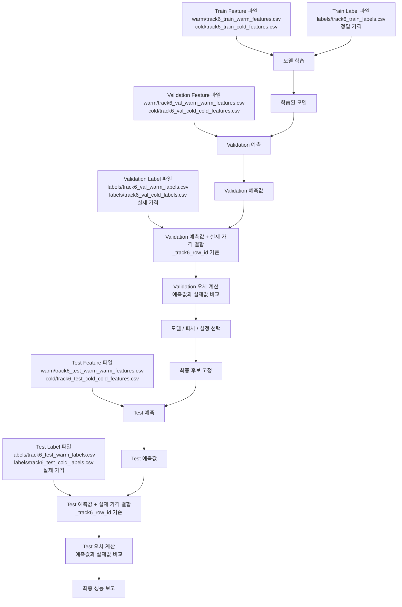

# Track 6 학습/평가 라벨 사용 흐름

- 목적: 라벨 파일을 언제 읽고 언제 읽지 않는지 명확히 정리
- 핵심 원칙: 라벨은 학습과 평가 단계에서만 읽고, 예측 단계에서는 읽지 않음
- 적용 범위: Warm 모델, Cold 모델, validation 평가, test 최종 평가

## 1. 전체 순서도



- 핵심 해석:
  - `warm/`은 `data/track6_split/features/warm/`의 축약 표기
  - `cold/`는 `data/track6_split/features/cold/`의 축약 표기
  - `labels/`는 `data/track6_split/labels/`의 축약 표기
  - 예측 단계에서는 feature 파일만 사용함
  - 평가 단계에서 예측값과 label 파일을 `_track6_row_id` 기준으로 합침
  - 합친 뒤에야 예측 가격과 실제 가격을 비교할 수 있음
  - 이 결합은 모델 입력이 아니라 성능 계산용으로만 사용함

## 2. 단계별 라벨 사용 기준

| 단계 | feature 사용 | label 사용 | 목적 | 라벨 사용 가능 여부 |
|---|---|---|---|---|
| 학습 | train feature | train label | 모델이 입력과 정답의 관계를 학습 | 가능 |
| validation 예측 | validation feature | 사용 안 함 | 후보 모델이 정답 없이 예측 | 금지 |
| validation 평가 | validation 예측값 | validation label | 예측값과 실제값을 결합해 오차 계산 | 가능 |
| 후보 고정 | 실험 결과 문서 | 사용 안 함 | 최종 후보를 문서로 고정 | 금지 |
| test 예측 | test feature | 사용 안 함 | 최종 후보가 정답 없이 예측 | 금지 |
| test 최종 평가 | test 예측값 | test label | 예측값과 실제값을 결합해 최종 성능 확인 | 가능 |
| 운영 예측 | 운영 입력 feature | 없음 | 실제 서비스 예측 | 불가 |

## 3. 학습 단계

- 읽는 파일:
  - feature: `data/track6_split/features/warm/track6_train_warm_features.csv`
  - feature: `data/track6_split/features/cold/track6_train_cold_features.csv`
  - label: `data/track6_split/labels/track6_train_labels.csv`
- 사용 방식:
  - feature 파일은 입력값 `X`로 사용
  - label 파일의 `ln_price_krw` 또는 `price_krw`는 정답값 `y`로 사용
  - feature와 label은 `_track6_row_id` 기준으로 맞춤
- 주의:
  - validation label을 학습에 사용하지 않음
  - test label을 학습에 사용하지 않음
  - full split CSV를 직접 학습 입력으로 사용하지 않음

```text
X_train = train_features
y_train = train_labels["ln_price_krw"]
model.fit(X_train, y_train)
```

## 4. validation 예측 단계

- 읽는 파일:
  - Warm feature: `data/track6_split/features/warm/track6_val_warm_warm_features.csv`
  - Cold feature: `data/track6_split/features/cold/track6_val_cold_cold_features.csv`
- 읽지 않는 파일:
  - `track6_val_warm_labels.csv`
  - `track6_val_cold_labels.csv`
- 사용 방식:
  - 모델은 validation feature만 보고 가격을 예측
  - 예측값은 `data/track6/predictions/`에 저장
- 목적:
  - 정답 가격을 보지 않은 상태에서 모델 예측값 생성

```text
pred_val = model.predict(val_features)
```

## 5. validation 평가 단계

- 읽는 파일:
  - validation prediction 파일
  - `data/track6_split/labels/track6_val_warm_labels.csv`
  - `data/track6_split/labels/track6_val_cold_labels.csv`
- 사용 방식:
  - 예측값과 label을 `_track6_row_id` 기준으로 결합
  - 실제 가격과 예측 가격을 비교
  - median APE, p95 APE, Within-30, Within-50, RMSE(log)를 계산
- 해석:
  - label은 validation 예측값이 나온 뒤에 붙임
  - label을 붙이는 이유는 예측값이 실제 가격과 얼마나 다른지 계산하기 위해서임
  - label을 붙인 결과는 모델 재학습 입력으로 사용하지 않음
- 목적:
  - 피처 선택
  - 모델 선택
  - 하이퍼파라미터 선택
  - 가격 범위 후보 선택

```text
evaluation_df = predictions + validation_labels by _track6_row_id
APE = |예측가격 - 실제가격| / 실제가격
```

## 6. 최종 후보 고정 단계

- 고정 대상:
  - Warm 모델
  - Cold 모델
  - 사용 피처
  - 전처리 방식
  - 보정 방식
  - 가격 범위 정책
- 기준:
  - validation 결과로만 후보를 고름
  - test 결과를 보기 전에 후보를 문서로 고정함
- 기록:
  - 개별 실험 문서
  - `docs/track6/tables/experiment_results_table.md`
  - 필요 시 model manifest

## 7. test 예측 단계

- 읽는 파일:
  - Warm feature: `data/track6_split/features/warm/track6_test_warm_warm_features.csv`
  - Cold feature: `data/track6_split/features/cold/track6_test_cold_cold_features.csv`
- 읽지 않는 파일:
  - `track6_test_warm_labels.csv`
  - `track6_test_cold_labels.csv`
- 사용 방식:
  - 최종 후보 모델이 test feature만 보고 예측
  - test label은 예측 단계에서 사용하지 않음
- 목적:
  - 최종 후보가 정답 없이 어느 정도 예측하는지 확인할 준비

## 8. test 최종 평가 단계

- 읽는 파일:
  - test prediction 파일
  - `data/track6_split/labels/track6_test_warm_labels.csv`
  - `data/track6_split/labels/track6_test_cold_labels.csv`
- 사용 방식:
  - 예측값과 test label을 `_track6_row_id` 기준으로 결합
  - 최종 성능을 계산
- 해석:
  - test label은 test 예측값이 나온 뒤에만 붙임
  - test label을 붙이는 이유는 최종 후보 모델의 예측값과 실제 가격을 비교하기 위해서임
- 주의:
  - test 결과를 보고 피처나 모델을 다시 바꾸지 않음
  - test 결과를 보고 바꾸면 기존 test 결과는 최종 성능으로 사용하지 않음

## 9. 한 줄 기준

- 학습: `train feature + train label`
- validation 예측: `validation feature only`
- validation 평가: `validation prediction + validation label`
- test 예측: `test feature only`
- test 평가: `test prediction + test label`
- 운영 예측: `운영 입력 feature only`

## 10. 중단 기준

- 예측 스크립트가 label 파일을 읽으면 중단
- 학습 스크립트가 validation/test label을 읽으면 중단
- 모델 실험 스크립트가 full split CSV를 직접 읽으면 중단
- test label을 본 뒤 후보를 바꾸면 해당 test 평가는 최종 평가로 인정하지 않음
