# 가격 예측 모델 v0.1 서비스 적용 계획

- 작성일: 2026-06-04
- 업데이트: 2026-06-05
- 기준 모델: `price_prediction_v0.1`
- 관련 API 문서: `docs/track6/planning/price_prediction_api_v0_1_spec.md`
- 목적: v0.1 가격 예측 모델을 서비스에서 사용하기 위해 필요한 데이터 관리 방식, 재학습 흐름, 환율/호당가 관리, 예측 모델 관련 최소 ERD를 정리
- 범위: 가격 예측 모델 운영에 필요한 데이터와 흐름만 포함

문서 구성:

1. v0.1 모델 적용 전제와 Warm/Cold 기준
2. 예측 서비스 처리 흐름
3. 서비스 데이터 관리 원칙
4. 작가/작품/가격/환율/통계/검색/피처 데이터 관리 방식
5. 예측 요청과 결과 저장 방식
6. 모델 버전과 재현 관리
7. 데이터 추가 수집 후 재학습 흐름
8. 예측 모델 관련 ERD
9. 개발 작업, 운영 모니터링, 정리

## 1. v0.1 적용 전제

| 항목 | v0.1 기준 |
|---|---|
| 모델 버전 | `price_prediction_v0.1` |
| 예측 단위 | 작품 1건 단위 가격 예측 |
| 예측 기준 통화 | KRW |
| Warm 기준 | `artist_key`가 확정되고 v0.1 학습 작가 목록에 있으며, 유효 가격 표본 수가 Warm route 정책을 만족하는 경우 |
| Cold 기준 | `artist_key`는 확정됐지만 v0.1 학습 작가 목록 미포함, 또는 유효 가격 표본 수가 부족해 Warm route 신뢰도가 낮은 경우 |
| 작가 미확정 기준 | 작가 후보를 확정하지 못한 경우. 가격 예측으로 바로 넘기지 않고 후보 선택/운영 검수/신규 작가 등록 흐름으로 분리 |
| Warm 표시 | 예측 가격, 가격 범위, 유사 작품 기반 가격 피처, 1차 시장 가격 카드 |
| Cold 표시 | 참고 예측가와 넓은 가격 범위 중심 |
| 서비스 연동 API | `GET /price-models/current`, `POST /artists:resolve`, `POST /artworks/price-estimate` |

### 1.1 Warm v0.1 정책

- 현재 기준 1순위 후보: 유사 작품 기반 가격 피처 70% + 오차 안정화 후보 30% 결합
- 의미:
  - 유사 작품 기반 가격 피처: 같은 작가 또는 비슷한 조건의 작품 가격 통계
  - 오차 안정화 후보: 특정 구간에서 예측값이 지나치게 튀지 않도록 보완한 Warm 후보
- 운영 주의:
  - v0.1은 중간 기준 모델 정책을 고정한 상태
  - 신규 데이터 직접 추론을 안정적으로 하려면 Warm 결합 구성요소를 하나의 추론 실행 묶음으로 패키징 필요

### 1.2 Cold v0.1 정책

- 현재 기준 후보: LightGBM Quantile + 예측 불확실성 구간 보정
- 의미:
  - LightGBM Quantile: 단일 가격만 맞히기보다 가격이 나올 수 있는 하한/중앙/상한 범위를 예측하는 방식
  - 예측 불확실성 구간: 상한 예측값과 하한 예측값의 차이
- 운영 주의:
  - Cold는 Warm보다 오차 위험이 큼
  - v0.1에서는 확정 가격처럼 보이지 않게 참고 가격/넓은 범위/낮은 신뢰도 중심으로 표시
  - Cold v0.1 기준 후보는 실험 당시 저장된 작가 단위 외부 검색 피처 캐시를 사용한 후보를 기반으로 함
  - 최신 운영형 검색 스냅샷은 v0.1 가격 모델 입력은 아니지만, 서비스 신뢰도/검수/후속 Cold 고도화에 사용 가능

### 1.3 Warm/Cold 분기 기준

분기 판단 순서:

```text
artist_key 확정 여부 확인
  -> 미확정이면 예측 보류 또는 후보 선택/검수 흐름
  -> 확정이면 v0.1 학습 작가 목록 포함 여부 확인
  -> 같은 작가의 유효 학습 가격 표본 수 확인
  -> Warm route 정책 충족 여부 판단
  -> Warm 또는 Cold route 결정
  -> route_reason과 confidence reason code 저장
```

분기 관리 필드:

| 필드 | 의미 |
|---|---|
| `artist_key_resolved` | 서비스 입력 작가가 표준 작가키로 확정됐는지 |
| `in_training_registry_v0_1` | v0.1 학습 작가 목록에 포함됐는지 |
| `valid_training_label_count_v0_1` | v0.1 학습 스냅샷에서 같은 작가의 유효 가격 라벨 수 |
| `warm_min_label_count` | Warm route 적용에 필요한 최소 표본 수. v0.1 정책값으로 고정 |
| `route` | 실제 적용 route. Warm 또는 Cold |
| `route_reason` | 분기 사유 |

v0.1 운영 원칙:

- `in_training_registry_v0_1=true`만으로 Warm을 확정하지 않음
- 작가키가 확정되지 않으면 Warm/Cold route를 결정하지 않고 예측 전 후보 선택/검수 흐름으로 분리
- 작가키가 확정됐지만 같은 작가의 유효 가격 표본 수가 부족하면 Cold 방식의 넓은 범위/낮은 신뢰도로 표시
- Warm route에 쓰는 최소 표본 수는 `model_version.warm_policy_json`에 저장
- 분기 결과와 분기 사유는 예측 결과와 함께 저장
- 후속 재학습에서 Warm 최소 표본 수를 바꾸면 기존 모델을 수정하지 않고 새 `model_version` 후보로 등록

### 1.4 가격 예측 계산 흐름

v0.1 공통 타깃:

```text
학습 타깃 = ln_price_krw = log(price_krw)
모델 출력 = pred_log_price
화면/API 가격 = pred_price_krw = exp(pred_log_price)
```

Warm v0.1 계산:

```text
svc_pred_log = 유사 작품 기반 가격 피처 후보의 log 가격 예측값
stability_pred_log = 오차 안정화 후보의 log 가격 예측값
warm_pred_log = 0.70 * svc_pred_log + 0.30 * stability_pred_log
warm_pred_price_krw = exp(warm_pred_log)
```

Cold v0.1 계산:

```text
cold_q10_log, cold_q50_log, cold_q90_log = LightGBM Quantile 예측값
quantile_width = cold_q90_log - cold_q10_log
cold_pred_log = cold_q50_log + quantile_width_based_correction
cold_pred_price_krw = exp(cold_pred_log)
cold_price_range = [exp(cold_q10_log), exp(cold_q90_log)]를 기준으로 생성
```

운영 저장 기준:

- 모델 내부 계산값은 log 가격 기준으로 저장
- API와 화면 표시값은 원화 가격 기준으로 저장
- `prediction_result`에는 원화 예측값과 범위를 저장
- `model_feature_snapshot`에는 log 입력/보정에 필요한 피처값과 정책 버전을 저장
- 가격 범위와 신뢰도는 모델 출력값만이 아니라 표본 수, 검색 품질, route 사유를 함께 반영

## 2. 예측 서비스 처리 흐름

```text
1. 작품 입력
2. 작가명 또는 artist_key 확인
3. POST /artists:resolve로 artist_key 확정
4. 작품 크기/재료/지지체/호수 피처 생성
5. artist_key 미확정이면 후보 선택/검수 흐름으로 종료
6. artist_key 확정 후 Warm/Cold route 결정
7. 유사 작품 기반 가격 통계 조회
8. v0.1 모델 추론
9. 가격 범위와 신뢰도 생성
10. 1차 시장 가격 카드 생성
11. 예측 요청/결과/피처 스냅샷 저장
```

작가 확정 처리:

- 입력 작가명은 모델에 직접 넣지 않음
- 한글/영문/로마자/원천별 표기는 `artist_alias`에서 후보를 찾음
- 후보가 단일하고 검수된 alias와 강하게 매칭되면 `artist_key` 자동 확정
- 후보가 여러 명이거나 미검수 alias이면 `requires_selection=true`로 후보 선택 창을 띄움
- `artist_key`가 확정된 뒤에만 Warm/Cold route를 판단

Warm 처리:

- `artist_key`가 확정되고 유효 가격 표본 수가 Warm route 정책을 만족하면 Warm으로 처리
- 유사 작품 기반 가격 피처를 우선 활용
- 예측 가격과 가격 범위를 함께 표시
- 표본 수가 적거나 가격 범위가 넓으면 신뢰도를 낮춤

Cold 처리:

- 작가키는 확정됐지만 학습 작가 목록 미포함, 또는 유효 가격 표본 수 부족이면 Cold로 처리
- 작가키가 확정되지 않은 경우는 Cold가 아니라 `ARTIST_NOT_RESOLVED` 또는 `ARTIST_AMBIGUOUS`로 예측 전 후보 선택/검수 흐름으로 분리
- LightGBM Quantile 기반 가격 범위를 사용
- v0.1 Cold 기준 후보는 pilot 검색 캐시 기반 피처를 사용한 실험 계열
- 최신 운영형 검색 스냅샷은 v0.1 가격 모델 입력으로 직접 섞지 않고, 서비스 신뢰도/검수/후속 모델 고도화에 사용
- 단일 확정가보다 참고 가격/범위 중심으로 표시
- 화면에는 Cold임을 직접 노출하기보다 신뢰도와 안내 문구로 표현

## 3. 서비스 데이터 관리 원칙

- 원천 데이터와 모델용 가공 데이터를 분리
- 가격 원문, 통화, 환율, 원화 환산가를 모두 보존
- 작가명 자유 입력값은 바로 모델에 넣지 않고 `artist_key`로 매핑
- 작품 크기, 재료, 지지체, 호수는 공통 전처리 규칙으로 정규화
- 유사 작품 기반 가격 피처는 매번 실시간 계산하지 않고 통계 스냅샷으로 관리
- Cold 외부 검색 피처는 원문 검색 결과와 작가 단위 집계 스냅샷을 분리해 관리
- 외부 검색 수집 데이터는 운영 DB에서 수집 실행 묶음과 스냅샷 묶음으로 관리
- CSV/JSONL 파일은 실험 근거, 초기 적재, 배치 검증용으로만 사용하고 운영 기준 원천은 DB 스냅샷으로 고정
- 검색 피처는 단일 가격을 직접 결정하는 강한 신호보다 신뢰도, 가격 범위, 수동 검수 우선순위에 우선 활용
- 예측 요청과 예측 결과는 저장해 재현, 검수, 성능 모니터링에 사용
- 모델 버전, 피처 스키마, 학습 데이터 스냅샷을 함께 보관
- Warm/Cold 모델 입력 피처는 피처명, 생성 규칙, 결측 처리, 사용 모델 버전을 DB에서 관리
- 실제 예측에 사용된 피처값은 예측 요청 단위 스냅샷으로 저장

## 4. 핵심 데이터 관리 방식

### 4.1 작가 데이터

| 테이블 | 역할 |
|---|---|
| `artist_master` | 작가의 표준 식별자, 이름 후보, 변하지 않는 기본 참고값 관리 |
| `artist_alias` | 한글/영문/로마자/오탈자/원천별 작가명 표기 변형 관리 |

| 필드 | 설명 |
|---|---|
| `artist_id` | 서비스 내부 작가 ID |
| `artist_key` | 모델에서 사용하는 작가 표준 키 |
| `name_ko` | 한글 작가명 |
| `name_en` | 영문 작가명 |
| `aliases` | 대표 별칭 요약. 정식 별칭/표기 변형은 `artist_alias`에서 관리 |
| `birth_year` | 출생연도. 표준 참고값이며 모델 입력은 `artist_market_profile_snapshot` 기준으로 고정 |
| `nationality` | 국적. 표준 참고값이며 모델 입력은 `artist_market_profile_snapshot` 기준으로 고정 |
| `entity_suffix` | 동명이인 또는 동일명 작가 구분용 suffix |
| `homonym_review_status` | 동명이인 검수 상태 |
| `artist_status` | 활성, 검수 필요, 병합 후보 등 |
| `in_training_registry_v0_1` | v0.1 학습 작가 목록 포함 여부 |
| `valid_training_label_count_v0_1` | v0.1 학습 스냅샷 기준 같은 작가의 유효 가격 라벨 수 |
| `warm_route_status_v0_1` | Warm 가능, 표본 부족, Cold 처리, 검수 필요 등 |
| `created_at`, `updated_at` | 생성/수정 시각 |

`artist_alias` 주요 필드:

| 필드 | 설명 |
|---|---|
| `alias_id` | 작가명 표기 ID |
| `artist_id` | 연결된 작가 ID |
| `alias_text` | 원문 표기. 예: 박서보, Park Seo-Bo, Park Seobo |
| `alias_normalized` | 비교용 정규화 표기. 공백/대소문자/하이픈 등 제거 |
| `alias_type` | `ko`, `en`, `romanized`, `source_name`, `typo`, `legacy` 등 |
| `source_name` | 표기가 확인된 원천 |
| `is_verified` | 운영 검수 완료 여부 |
| `match_priority` | 동일 작가 내 우선순위 |
| `created_at`, `updated_at` | 생성/수정 시각 |

- 서비스 입력 단계에서 작가명을 직접 입력받더라도 최종 예측 전에는 `artist_key`를 확정
- 동명이인 또는 유사 이름 후보가 있으면 사용자 또는 운영자가 작가를 선택
- 한글/영문/로마자/하이픈/띄어쓰기 차이는 `artist_alias.alias_normalized` 기준으로 후보를 찾음
- 후보가 1명이고 검수된 별칭에서 강하게 매칭되면 자동 선택 가능
- 후보가 여러 명이거나 검수되지 않은 별칭만 매칭되면 `review_required`로 분리
- `in_training_registry_v0_1=true`이고 유효 가격 표본 수가 Warm route 정책을 만족하면 Warm 후보
- `in_training_registry_v0_1=true`라도 유효 가격 표본 수가 부족하면 Cold 방식의 보수적 표시 또는 검수 대상으로 분리
- `in_training_registry_v0_1=false`이면 Cold 후보
- `artist_master.birth_year`, `artist_master.nationality`는 서비스 식별/검수 참고값
- Cold 모델 입력으로 사용되는 작가 메타값은 모델 버전과 수집 시점을 고정한 `artist_market_profile_snapshot`을 기준으로 사용

작가명 확정 프로세스:

```text
입력 작가명 수신
  -> POST /artists:resolve 호출
  -> 입력값 정규화
  -> artist_alias에서 한글/영문/로마자/원천 표기 후보 검색
  -> artist_master의 표준 작가 정보와 결합
  -> 후보별 match_status, match_basis, review_required 계산
  -> 후보 1명이 충분히 확실하면 artist_key 자동 확정
  -> 후보가 여러 명이거나 동명이인 위험이 있으면 사용자/운영자 선택
  -> artist_key 확정 후 Warm/Cold route 판단
```

작가명 정규화 기준:

- 한글/영문 공백 제거
- 영문 대소문자 통일
- 하이픈, 점, 쉼표 등 비교용 기호 제거
- 한글명, 영문명, 로마자 표기, 원천 사이트 표기를 모두 별칭 후보로 비교
- 자동 확정은 검수된 alias와 단일 작가 후보가 동시에 만족될 때만 허용

작가 입력창 API 처리 기준:

| 상황 | API 처리 | 화면 처리 |
|---|---|---|
| 검수된 alias가 단일 작가와 강하게 매칭 | `/artists:resolve`에서 `resolved=true`, `requires_selection=false` | 자동 선택하되 선택된 작가명을 표시 |
| 동일/유사 후보가 2명 이상 | `/artists:resolve`에서 `resolved=false`, `requires_selection=true` | 후보 선택 창 표시 |
| 미검수 alias 또는 낮은 확신도 | `/artists:resolve`에서 `review_required=true` | 운영자 검수 또는 사용자 확인 유도 |
| 후보 없음 | `ARTIST_NOT_RESOLVED` warning 반환 | 신규 작가 등록/검수 흐름으로 분리 |

후보 선택 창에 표시할 최소 정보:

- 한글명
- 영문명
- 출생연도
- 국적
- 동일명 구분 suffix
- 실제 매칭된 표기값
- Warm 가능 여부

자동완성 정책:

- 1차 MVP는 `/artists:resolve`로 입력 완료 후 후보를 반환하는 방식으로 충분
- 입력 중 실시간 자동완성이 필요하면 2차 API로 `GET /artists:search?q={query}`를 추가
- 자동완성 API를 추가하더라도 최종 가격 예측 전 확정은 `/artists:resolve` 기준으로 수행

### 4.2 작품 데이터

| 테이블 | 역할 |
|---|---|
| `artwork_master` | 예측 대상 작품의 정규화된 기본 정보 관리 |

| 필드 | 설명 |
|---|---|
| `artwork_id` | 서비스 내부 작품 ID |
| `external_artwork_id` | 외부 수집처 작품 ID |
| `artist_id` | 작가 ID |
| `title` | 작품명 |
| `created_year` | 제작연도 |
| `width_cm`, `height_cm`, `depth_cm` | 작품 크기 |
| `area_cm2` | 2D 기준 면적 |
| `estimated_ho` | 실험과 동일한 기준으로 환산한 추정 호수 |
| `medium_category` | 재료 대분류 |
| `support_category` | 지지체 대분류 |
| `medium_support_bucket` | 재료와 지지체를 묶은 버킷 |
| `is_3d_candidate` | 입체 작품 후보 여부 |
| `artwork_source_url` | 원천 URL |
| `data_status` | 원천, 정규화 완료, 검수 완료 등 |

- `medium_support_bucket`은 희소한 재료/지지체 조합을 묶어 모델이 안정적으로 학습하도록 만든 피처
- 작품명은 가격 예측 핵심 피처는 아니지만, 유사 작품 노출과 운영 검수에 필요
- `estimated_ho`가 없으면 크기 정보로 자동 계산

### 4.3 가격 이력 데이터

| 테이블 | 역할 |
|---|---|
| `price_history` | 작품별 판매가, 호가, 추정가, 수집 가격 이력 관리 |

| 필드 | 설명 |
|---|---|
| `price_history_id` | 가격 이력 ID |
| `artwork_id` | 작품 ID |
| `price_amount` | 원문 가격 |
| `currency` | 원문 통화 |
| `exchange_rate_id` | 원화 환산에 사용한 환율 ID |
| `price_krw` | 원화 환산 가격 |
| `price_type` | 판매가, 호가, 추정가, 낙찰가 등 |
| `price_date` | 가격 기준일 또는 거래일 |
| `source_name` | 가격 수집 출처 |
| `source_url` | 가격 출처 URL |
| `is_numeric_price` | 숫자 가격 여부 |
| `is_valid_for_training` | 학습 라벨로 사용 가능 여부 |
| `is_valid_for_comparable_stats` | 유사 작품 기반 가격 통계에 사용 가능 여부 |
| `review_status` | 자동 통과, 운영 검수 필요, 제외 |

- 숫자 가격이 없는 `Sold`, `Price on request` 등은 학습 라벨에서 제외
- `US$1`, `US$10`처럼 실제 거래가가 아니라 임시/대체 가격값으로 의심되는 값은 검수 필요로 분리
- 원문 가격과 원화 환산가를 모두 저장해 환율 정책 변경 시 재현 가능하게 관리

### 4.4 환율 데이터

| 테이블 | 역할 |
|---|---|
| `exchange_rate` | 통화별 원화 환산 기준 관리 |

| 필드 | 설명 |
|---|---|
| `exchange_rate_id` | 환율 ID |
| `currency` | 원문 통화 |
| `rate_to_krw` | 1통화당 원화 환산값 |
| `effective_date` | 환율 적용일 |
| `source_name` | 환율 출처 |
| `source_type` | 고정 기준, 운영 환율, 외부 API 등 |
| `model_version` | 특정 모델 재현용 환율 스냅샷 |
| `created_at` | 생성 시각 |

v0.1 평가에서 확인한 기준 환율:

| 통화 | 원화 환산 |
|---|---:|
| USD | 1,380 KRW |
| EUR | 1,530 KRW |
| GBP | 1,780 KRW |
| HKD | 178 KRW |
| JPY | 9.5 KRW |

운영 관리 원칙:

- 가격 이력 저장 시점에 사용한 환율을 `exchange_rate_id`로 고정
- 모델 재학습 시에는 학습 데이터 스냅샷과 환율 스냅샷을 함께 고정
- 실시간 환율이 바뀌어도 과거 학습 결과가 바뀌지 않게 관리
- 화면 표시는 KRW를 기본으로 하고, 외화 표시는 별도 정책 확정 후 추가

### 4.5 호당가 통계 데이터

| 테이블 | 역할 |
|---|---|
| `unit_price_stat_snapshot` | 유사 작품 묶음별 호당가/가격 통계 스냅샷 관리 |

| 필드 | 설명 |
|---|---|
| `stat_snapshot_id` | 통계 스냅샷 ID |
| `model_version` | 통계가 연결된 모델 버전 |
| `group_level` | 유사 작품 묶음 기준 |
| `artist_id` | 작가 기준 통계인 경우 |
| `medium_category` | 재료 기준 |
| `support_category` | 지지체 기준 |
| `medium_support_bucket` | 재료/지지체 묶음 기준 |
| `size_bucket` | 크기 구간 기준 |
| `sample_count` | 유효 표본 수 |
| `price_median_krw` | 가격 중앙값 |
| `price_q25_krw`, `price_q75_krw` | 가격 분위 범위 |
| `unit_price_per_ho_median_krw` | 호당가 중앙값 |
| `unit_price_per_ho_q25_krw`, `unit_price_per_ho_q75_krw` | 호당가 분위 범위 |
| `medium_distribution_json` | 매체별 호당가 분포 |
| `created_at` | 생성 시각 |

호수/호당가 산출 기준:

```text
estimated_ho = F형 캔버스 호수별 참조 면적표에서 작품 면적과 가장 가까운 호수
unit_price_per_ho = price_krw / estimated_ho
```

- `estimated_ho`는 실험에서 사용한 기존 v1 기준을 서비스에서도 동일하게 사용
- `estimated_ho` 산출 기준 버전은 `ho_policy_version`으로 별도 기록
- 크기 정보가 부족하거나 입체 작품으로 판단되면 호당가를 null로 두고 가격 범위 중심으로 표시

유사 작품 묶음 fallback 순서:

| 우선순위 | 묶음 기준 | 최소 표본 수 | 사용 목적 |
|---:|---|---:|---|
| 1 | 작가 + 재료/지지체 + 크기 | 5 | 가장 구체적인 Warm 기준 |
| 2 | 작가 + 크기 | 5 | 재료/지지체 표본이 부족할 때 |
| 3 | 작가 전체 | 5 | 작가 가격 기준선 확보 |
| 4 | 재료/지지체 + 크기 | 30 | 작가 표본 부족 시 보조 |
| 5 | 재료 + 지지체 + 크기 | 30 | 묶음 기준 보조 |
| 6 | 재료 + 크기 | 50 | 가장 넓은 fallback |

- 상위 기준이 최소 표본 수를 만족하면 해당 통계를 사용
- 만족하지 못하면 다음 fallback 기준으로 내려감
- 모든 기준이 부족하면 가격 범위와 신뢰도를 보수적으로 표시

### 4.6 Cold 외부 검색 피처 데이터

| 테이블 | 역할 |
|---|---|
| `external_search_collection_run` | 외부 검색 수집 실행 단위, provider 구성, query template 버전, 수집 상태 관리 |
| `artist_external_search_snapshot` | 작가별 외부 검색 결과를 모델/서비스가 쓰기 쉬운 피처로 집계한 월 단위 스냅샷 |
| `artist_external_search_result` | provider별 원문 검색 결과와 표준화된 문맥 판정값 저장 |

적용 범위 요약:

| 구분 | v0.1 모델 입력 여부 | 서비스 적용 기준 |
|---|---|---|
| pilot 검색 캐시 | 사용 | v0.1 Cold 기준 후보의 학습/평가 피처 원천. 운영 DB에는 동일 내용을 스냅샷으로 이관해 재현 |
| 최신 운영형 검색 스냅샷 | 가격 모델 입력 아님 | DB 스냅샷으로 관리하고 서비스 신뢰도/검수/후속 Cold 고도화 후보로 사용 |
| Naver 공식 API 결과 | v0.1 원 실험 입력 아님 | 최신 운영형 DB 스냅샷에 포함되는 provider |
| Google Custom Search | 사용 안 함 | 수집 스크립트 옵션은 있으나 v0.1 기준 후보와 최신 운영형 provider 집계에는 미포함 |

외부 검색 데이터 처리 흐름:

```text
artist_key 확정
  -> 작가 표준명/별칭/영문명 기준 검색 query 생성
  -> provider별 검색 수집
  -> 원문 검색 결과 저장
  -> title/snippet/url/domain/rank 표준화
  -> 미술/전시/갤러리/시장/동명이인 문맥 판정
  -> 작가 단위 검색 피처 집계
  -> 검색 품질 등급과 동명이인 위험 등급 산출
  -> 검색 스냅샷 묶음 생성
  -> Cold 신뢰도/검수/후속 모델 후보에 연결
```

운영 저장 판단:

- 외부 검색 데이터는 운영 DB 스냅샷으로 관리하는 것이 맞음
- 이유: 검색 결과는 provider 상태, 검색 순위, 웹 문서 변화에 따라 같은 query라도 시간이 지나면 달라질 수 있음
- `external_search_collection_run`은 수집 실행 단위의 provider 목록, query template 버전, 수집 시각, 성공/실패 상태를 저장
- `artist_external_search_result`는 provider가 반환한 원문/표준화 결과를 row 단위로 저장
- `artist_external_search_snapshot`은 원문 결과를 작가 단위 피처로 집계한 결과를 저장
- `artist_external_search_snapshot.snapshot_purpose`로 `model_training`, `service_confidence`, `candidate_feature`를 구분
- `artist_external_search_snapshot.linked_model_version`은 특정 모델 학습/검증에 직접 연결된 경우에만 저장
- `model_version`은 학습 또는 후보 검증에 사용한 검색 스냅샷 묶음 ID를 저장
- `model_feature_snapshot`은 실제 예측에 사용한 작가별 검색 스냅샷 row ID를 저장
- 파일 산출물은 실험 evidence와 배치 검증용으로 보관하되, 서비스 운영 기준은 DB 스냅샷을 기준으로 함

단계별 처리 기준:

| 단계 | 처리 내용 | 저장 위치 | 운영 기준 |
|---:|---|---|---|
| 1 | 작가명 query 생성 | `artist_alias`, 수집 로그 | 한글명, 영문명, 로마자 표기, 원천 표기를 모두 후보로 사용 |
| 2 | provider별 검색 수집 | `external_search_collection_run`, `artist_external_search_result` | Python DDG 계열과 Naver API 결과를 provider별로 분리 저장 |
| 3 | 원문 결과 표준화 | `artist_external_search_result` | title, snippet, url, domain, rank, provider를 동일 포맷으로 정리 |
| 4 | 문맥 판정 | `artist_external_search_result` | 미술/전시/갤러리/시장/동명이인/최근성/작가명 포함 여부 판정 |
| 5 | 작가 단위 집계 | `artist_external_search_snapshot` | 결과 수, source 수, 문맥별 count, provider 커버리지 집계 |
| 6 | 품질 등급 산출 | `artist_external_search_snapshot` | 검색 품질, 동명이인 위험, provider 일치도 산출 |
| 7 | 모델/서비스 연결 | `model_version`, `model_feature_snapshot` | v0.1 가격 모델에는 직접 최신 입력으로 쓰지 않고 서비스 신뢰도/검수/후속 후보에 연결. 새 가격 모델 입력으로 쓰려면 새 `model_version`으로 검증 |

provider 사용 기준:

- `python_ddg`: 기본 웹 검색 결과 수집
- `python_ddg_art_context`: 작가/미술 문맥을 강화한 검색 결과 수집
- `naver_api_webkr`, `naver_api_blog`, `naver_api_news`: Naver 공식 API 기반 국내 검색 보조
- `google_cse`: 수집 스크립트 옵션으로만 존재하며 v0.1 기준 후보와 최신 운영형 스냅샷에는 사용하지 않음

실제 수집 구현 기준:

| provider | 실제 호출 방식 | 인증/의존성 | query 처리 | 수집 결과 |
|---|---|---|---|---|
| `python_ddg` | Python `ddgs` 라이브러리의 `DDGS.text()` 호출 | API key 불필요. `ddgs` 우선, 없으면 `duckduckgo_search` fallback | 작가명 query를 그대로 검색 | title, body/snippet, href를 표준 결과로 변환 |
| `python_ddg_art_context` | `DDGS.text()` 호출 | API key 불필요 | 작가명 뒤에 `artist gallery exhibition auction artwork`를 붙여 미술 문맥 강화 | title, body/snippet, href를 표준 결과로 변환 |
| `naver_api_webkr` | `https://openapi.naver.com/v1/search/webkr.json` 호출 | `NAVER_CLIENT_ID`, `NAVER_CLIENT_SECRET` 필요 | query, display, sort=sim 전달 | title, description, link, postdate/pubDate를 표준 결과로 변환 |
| `naver_api_blog` | `https://openapi.naver.com/v1/search/blog.json` 호출 | `NAVER_CLIENT_ID`, `NAVER_CLIENT_SECRET` 필요 | query, display, sort=sim 전달 | title, description, link, postdate를 표준 결과로 변환 |
| `naver_api_news` | `https://openapi.naver.com/v1/search/news.json` 호출 | `NAVER_CLIENT_ID`, `NAVER_CLIENT_SECRET` 필요 | query, display, sort=sim 전달 | title, description, link, pubDate를 표준 결과로 변환 |
| `google_cse` | Google Custom Search API 호출 옵션 | `GOOGLE_API_KEY`, `GOOGLE_CSE_ID` 필요 | q, cx, key, num 전달 | v0.1 기준 후보와 최신 운영형 스냅샷에는 미사용 |

검색 query template:

| template_id | query 형식 | 목적 |
|---|---|---|
| `name_artist_ko` | `{name} 미술 작가` | 작가 기본 미술 문맥 확인 |
| `name_artwork_ko` | `{name} 작품 미술` | 작품 관련 문맥 확인 |
| `name_exhibition_ko` | `{name} 전시 작가` | 전시/개인전 문맥 확인 |
| `name_gallery_ko` | `{name} 갤러리 미술` | 갤러리/미술관 문맥 확인 |
| `name_auction_ko` | `{name} 작품 경매` | 시장/거래 문맥 확인 |

원문 검색 결과 저장 필드:

| 필드 | 의미 |
|---|---|
| `search_result_id` | 검색 결과 row ID |
| `collector_run_id` 또는 `collection_run_id` | 수집 실행 ID |
| `search_snapshot_id` | 작가 단위 집계 스냅샷 ID |
| `snapshot_group_id` | 같은 수집 실행에서 생성된 검색 스냅샷 묶음 ID |
| `snapshot_month` | 검색 스냅샷 기준 월 |
| `artist_search_name` | 검색에 사용한 작가명 |
| `provider` | 검색 provider |
| `query_template_id`, `query_text` | 사용한 query template과 실제 검색어 |
| `rank` | provider 결과 내 순위 |
| `title`, `snippet`, `url`, `domain` | 표준화된 검색 결과 정보 |
| `source_group` | gallery/museum, market, news, social/blog 등 출처 그룹 |
| `published_at` | provider가 제공한 발행일 또는 게시일 |
| `http_status`, `error` | provider 호출 상태와 오류 메시지 |
| `raw_payload_hash` | 원문 결과 재현 확인용 해시 |
| `collected_at` | 수집 시각 |

운영 적용 원칙:

- 검색 결과 원문은 가격 예측 API 응답에 직접 노출하지 않음
- 원문 검색 결과는 재현, 검수, provider 품질 점검용으로 보관
- 작가 단위 집계 피처만 서비스 신뢰도, 가격 범위 표시 정책, 수동 검수 우선순위에 사용
- v0.1 가격 모델의 입력 피처와 서비스 신뢰도/검수 보조 피처를 분리
- 운영 API는 CSV/JSONL 파일을 직접 읽지 않고 DB의 최신 승인 스냅샷을 조회
- v0.1 evidence 파일은 모델 재현용으로 보관하고, 운영 적용 시에는 동일 내용을 DB 스냅샷으로 적재
- 최신 검색 스냅샷을 가격 예측 입력 피처로 새로 사용하려면 기존 v0.1을 수정하지 않고 새 `model_version` 후보로 검증
- 검색 수집 실패, provider 응답 지연, 동명이인 위험 증가는 가격을 직접 보정하지 않고 confidence와 warning에 우선 반영

v0.1 파일과 운영 DB 적용 구분:

| 구분 | 파일 | 역할 | 운영 DB 기준 |
|---|---|---|---|
| Cold 원 실험 검색 피처 | `data/track6/external_search/track6_artist_search_pilot_features.csv` | PP-Y2 Cold 검색 피처 학습 입력 | v0.1 재현용 evidence. 운영에서는 `artist_external_search_snapshot`으로 이관 |
| Cold 원 실험 검색 원문 | `data/track6/external_search/track6_artist_search_pilot_raw.jsonl` | pilot 검색 결과 원문 | 재현/검수용 evidence. 운영에서는 `artist_external_search_result`로 이관 |
| 최신 운영형 작가 스냅샷 | `data/track6/external_search/operational/track6_artist_search_operational_snapshot_latest.csv` | 작가 단위 최신 검색 품질 피처 | 후속 고도화/서비스 신뢰도 정책용. 운영 승인 후 `artist_external_search_snapshot`에 적재 |
| 최신 운영형 표준화 결과 | `data/track6/external_search/operational/track6_artist_search_operational_standardized_latest.csv` | provider별 표준화 검색 결과 | 후속 고도화/검수용. 운영 승인 후 `artist_external_search_result`에 적재 |

v0.1 Cold 원 실험 검색 피처 현황:

| 항목 | 값 |
|---|---:|
| 작가 단위 검색 피처 row | 120 |
| 검색 품질 medium | 7명 |
| 검색 품질 low | 113명 |
| 검색 품질 high | 0명 |
| 동명이인 위험 clear | 76명 |
| 동명이인 위험 watch | 13명 |
| 동명이인 위험 risk | 31명 |

최신 운영형 검색 스냅샷 현황:

| 항목 | 값 |
|---|---:|
| 작가 단위 snapshot row | 428 |
| 표준화 검색 결과 row | 30,910 |
| 검색 품질 medium | 12명 |
| 검색 품질 low | 416명 |
| 검색 품질 high | 0명 |
| 동명이인 위험 clear | 354명 |
| 동명이인 위험 watch | 36명 |
| 동명이인 위험 risk | 38명 |

최신 운영형 provider 구성:

| provider | row 수 | 해석 |
|---|---:|---|
| `python_ddg_art_context` | 12,833 | Python 검색 라이브러리 기반, 미술 문맥 강화 |
| `python_ddg` | 12,818 | Python 검색 라이브러리 기반 기본 검색 |
| `naver_api_webkr` | 1,900 | Naver 공식 API 웹문서 |
| `naver_api_blog` | 1,760 | Naver 공식 API 블로그 |
| `naver_api_news` | 1,599 | Naver 공식 API 뉴스 |

검색 피처 주요 필드:

| 필드 | 의미 |
|---|---|
| `snapshot_purpose` | 검색 스냅샷 용도. `model_training`, `service_confidence`, `candidate_feature` |
| `linked_model_version` | 특정 모델 학습/검증에 직접 연결된 경우의 모델 버전. 서비스 신뢰도 전용 최신 스냅샷은 null 가능 |
| `search_result_count` | 전체 웹 검색량이 아니라 수집 스크립트가 가져온 상위 검색 결과 row 수 |
| `search_source_count` | 검색 결과 URL의 고유 도메인 수 |
| `search_art_context_count` | 미술/작가/작품 문맥이 감지된 결과 수 |
| `search_exhibition_context_count` | 전시/개인전/아트페어 문맥 결과 수 |
| `search_gallery_context_count` | 갤러리/미술관 문맥 결과 수 |
| `search_market_context_count` | 경매/판매/가격 문맥 결과 수 |
| `search_homonym_context_count` | 동명이인 또는 무관 인물 위험 문맥 결과 수 |
| `search_quality_score` | 검색 결과의 미술 문맥성과 신뢰성을 합산한 점수 |
| `search_quality_grade` | `high`, `medium`, `low`, `missing` |
| `search_homonym_risk_grade` | `clear`, `watch`, `risk` |

후속 운영형 검색 품질 점수 산식:

```text
search_quality_score =
  0.30 * 미술 문맥 비율
+ 0.20 * 신뢰 도메인 비율
+ 0.15 * 전시 문맥 비율
+ 0.15 * 시장/거래 문맥 비율
+ 0.10 * 최근 결과 비율
+ 0.10 * provider 커버리지 점수
+ 0.10 * 작가명 일치 비율
- 0.30 * 동명이인 위험 비율
```

Cold v0.1 서비스 적용 기준:

- Google Custom Search는 현재 Cold v0.1 실험 피처로 사용하지 않음
- Naver 공식 API 결과는 최신 운영형 스냅샷에는 포함되어 있으나, v0.1 Cold 원 실험 입력은 pilot 검색 캐시 기반
- 최신 운영형 검색 스냅샷을 v0.1 가격 모델 입력으로 직접 섞으면 학습 시점의 피처 분포와 달라질 수 있으므로 새 `model_version` 후보 검증이 필요
- 검색 품질 `low` 또는 동명이인 위험 `risk` 작가는 가격을 직접 보정하기보다 신뢰도 하향, 가격 범위 확대, 수동 검수 우선순위에 사용
- 검색 품질 `medium` 이상이고 provider 일치도가 확보된 경우에도 v0.1에서는 신뢰도/검수 보조 신호로 우선 사용
- 해당 검색 피처를 가격 예측 입력으로 적극 반영하려면 후속 Cold 모델 후보에서 동일 split/동일 평가 기준으로 재검증
- 운영에서는 검색 결과 원문을 예측 API 응답에 직접 노출하지 않고, 집계된 신뢰도/문맥 피처와 reason code만 사용
- `model_version`에는 학습/후보 검증에 사용한 검색 스냅샷 전체 묶음 ID를 저장. 서비스 신뢰도 전용 최신 스냅샷은 모델 입력 스냅샷과 구분
- `model_feature_snapshot`에는 예측에 실제 사용한 작가별 검색 스냅샷 row ID를 저장
- 파일 경로를 모델 입력 기준으로 직접 참조하지 않고, DB 스냅샷 ID를 기준으로 추론과 재현을 연결

### 4.7 Cold 모델 입력 데이터 커버리지

검토 결과:

- 기존 ERD의 `artist_master`는 작가 식별, 기본 이름, 변하지 않는 참고값 관리에는 충분
- Cold 실험에서 사용한 작가 메타 피처 전체를 담기에는 부족
- Cold에서 사용한 전시/갤러리 피처는 `artist_master`나 `artwork_master`에 직접 넣기보다 별도 활동/갤러리 스냅샷으로 관리하는 것이 적절
- 검색 피처는 `external_search_collection_run`, `artist_external_search_snapshot`, `artist_external_search_result`로 수집 실행/집계/원문을 분리해 관리하는 것이 적절
- 모델 내부 생성 피처와 상호작용 피처는 별도 원천 테이블보다 `model_feature_definition`의 생성 규칙과 `model_feature_snapshot`의 실제 입력값으로 관리하는 것이 적절

Cold v0.1 계열에서 사용된 데이터 묶음과 ERD 보완 결과:

| 데이터 묶음 | 실제 사용 예시 | 보완 전 상태 | 보완 결과 |
|---|---|---|---|
| 작품 기본 정보 | 크기, 면적, 깊이, 3D 여부, 재료, 지지체 | `artwork_master`에 대부분 반영 | 원천 row 재현을 위해 `artwork_source_record` 추가 |
| 가격 라벨 | `price_krw`, `ln_price_krw`, 통화, 환율 | `price_history`, `exchange_rate`에 반영 | 유지 |
| 작가 기본 식별 | `artist_key`, 작가명, 동명이인 여부 | `artist_master`에 일부 반영 | `entity_suffix`, `homonym_review_status` 보강 |
| 작가 메타 | 국적, 출생연도, 총 작품 수, 판매중 작품 수, 팔로워 수, P1 여부, 국제 활동 여부 | 일부만 `artist_master`에 반영 | `artist_market_profile_snapshot` 추가 |
| 전시/갤러리 활동 | 개인전/단체전/아트페어 수, 갤러리 티어, 갤러리 도시 수, 검수 상태 | 미반영 | `artist_activity_snapshot` 추가 |
| 외부 검색 집계 | 검색 결과 수, 미술 문맥 수, 검색 품질, 동명이인 위험 | 일부 반영 | `external_search_collection_run`, `artist_external_search_snapshot`, `artist_external_search_result`로 수집 실행/집계/원문 분리 |
| 생성 bucket | size/shape/support/medium bucket | `artwork_master`, `model_feature_definition`에 일부 반영 | 원천 DB보다 피처 정의로 관리 |
| 상호작용 피처 | 검색품질 x 면적, 전시수 x 면적, 갤러리티어 x 팔로워 | 미반영 | `model_feature_definition`에서 계산 규칙으로 관리 |
| Quantile/보정 피처 | q10/q50/q90, qwidth, price_range_ratio, residual correction | `prediction_result`에 일부 반영 | `model_component_prediction`으로 컴포넌트 출력 로그 관리 |

ERD에 보완 반영한 테이블:

| 테이블 | 역할 |
|---|---|
| `artwork_source_record` | 외부 원천 데이터의 source/row index/source artwork id를 보관해 실험 피처와 운영 DB를 재연결 |
| `external_search_collection_run` | 외부 검색 provider, query template, 수집 상태, 스냅샷 묶음 ID를 실행 단위로 관리 |
| `artist_market_profile_snapshot` | Cold 작가 메타 피처를 월/모델 버전 단위로 관리 |
| `artist_activity_snapshot` | 전시/갤러리/활동성 피처를 작가 단위 스냅샷으로 관리 |
| `model_component_prediction` | Quantile q10/q50/q90, qwidth, 보정 전후 예측값 등 모델 컴포넌트 출력을 저장 |

`artwork_source_record` 주요 필드:

| 필드 | 설명 |
|---|---|
| `source_record_id` | 원천 레코드 ID |
| `artwork_id` | 서비스 작품 ID |
| `track_source` | 원천 구분. 예: saatchi, artsy, artue, gallery_primary |
| `track_source_row_index` | 원천 row index |
| `source_artwork_id` | 원천 작품 ID |
| `artwork_url` | 작품 원문 URL |
| `image_url` | 이미지 URL |
| `source_payload_json` | 원천에서 받은 주요 필드 보관 |
| `created_at` | 생성 시각 |

`external_search_collection_run` 주요 필드:

| 필드 | 설명 |
|---|---|
| `collection_run_id` | 외부 검색 수집 실행 ID |
| `snapshot_group_id` | 같은 수집 실행에서 생성된 검색 스냅샷 묶음 ID |
| `snapshot_month` | 스냅샷 기준 월 |
| `provider_set_json` | 사용한 provider 목록. 예: python_ddg, naver_api_webkr |
| `query_template_version` | 검색 query template 버전 |
| `collector_version` | 수집/표준화 코드 버전 |
| `started_at`, `finished_at` | 수집 시작/종료 시각 |
| `run_status` | success, partial_success, failed |
| `provider_status_json` | provider별 성공/실패, 응답 수, 오류 요약 |
| `created_at` | 생성 시각 |

`artist_market_profile_snapshot` 주요 필드:

| 필드 | 설명 |
|---|---|
| `artist_profile_snapshot_id` | 작가 메타 스냅샷 ID |
| `snapshot_group_id` | 같은 수집/검수 실행에서 생성된 작가 메타 스냅샷 묶음 ID |
| `artist_id` | 작가 ID |
| `model_version` | 연결된 모델 버전 |
| `profile_month` | 스냅샷 기준 월 |
| `meta_source` | 작가 메타 원천 |
| `nationality`, `nationality_ko` | 국적 |
| `birth_year` | 출생연도 |
| `total_works` | 수집 원천 기준 총 작품 수 |
| `for_sale_works` | 판매중 작품 수 |
| `followers` | 팔로워 수 |
| `for_sale_ratio` | 판매중 작품 비율 |
| `career_age`, `career_stage` | 활동 연차/단계 |
| `is_p1` | P1 작가 여부 |
| `has_international` | 국제 활동 신호 여부 |
| `is_high_price_candidate` | 고가 후보 flag |
| `missing_flags_json` | 결측 flag 묶음 |
| `created_at` | 생성 시각 |

`artist_activity_snapshot` 주요 필드:

| 필드 | 설명 |
|---|---|
| `artist_activity_snapshot_id` | 작가 활동 스냅샷 ID |
| `snapshot_group_id` | 같은 수집/검수 실행에서 생성된 활동 스냅샷 묶음 ID |
| `artist_id` | 작가 ID |
| `model_version` | 연결된 모델 버전 |
| `activity_month` | 스냅샷 기준 월 |
| `solo_exhibition_count` | 개인전 수 |
| `group_exhibition_count` | 단체전 수 |
| `fair_exhibition_count` | 아트페어 수 |
| `total_exhibition_count` | 전시/활동 총합 |
| `available_exhibition_field_count` | 전시 관련 사용 가능 필드 수 |
| `gallery_tier_raw_numeric` | 원천 갤러리 티어 숫자값 |
| `gallery_tier_validated` | 검수된 갤러리 티어 |
| `gallery_tier_validated_score` | 검수 갤러리 티어 점수 |
| `gallery_city_count` | 갤러리 도시 수 |
| `gallery_ref_type` | 갤러리 참조 유형 |
| `gallery_audit_status` | 갤러리 검수 상태 |
| `gallery_feature_source` | validated, raw, missing |
| `created_at` | 생성 시각 |

`model_component_prediction` 주요 필드:

| 필드 | 설명 |
|---|---|
| `component_prediction_id` | 컴포넌트 예측 ID |
| `prediction_request_id` | 예측 요청 ID |
| `model_version` | 모델 버전 |
| `route` | Warm 또는 Cold |
| `component_name` | q10, q50, q90, base_pred, residual, corrected 등 |
| `pred_log` | log 가격 기준 컴포넌트 예측값 |
| `pred_price_krw` | 원화 변환 예측값 |
| `quantile_width_log` | q90 - q10 |
| `price_range_ratio` | exp(q90) / exp(q10) |
| `created_at` | 생성 시각 |

DB에 직접 저장하지 않아도 되는 피처:

- 로그 변환값: `log_area`, `followers_log`, `total_works_log` 등은 원천값과 `model_feature_definition`의 변환 규칙으로 재생성 가능
- 결측 flag: 원천값과 결측 처리 규칙으로 재생성 가능하나, 실제 예측 재현을 위해 `model_feature_snapshot`에는 저장
- 상호작용 피처: `search_quality_x_log_area`, `exhibition_total_x_log_area` 등은 피처 정의의 계산식으로 관리
- bucket 피처: `size_bucket`, `support_size_bucket`, `gallery_exhibition_bucket` 등은 bucket 정책 버전과 피처 스냅샷으로 관리

운영 적용 원칙:

- `artist_master`에는 안정적인 작가 식별 정보와 변하지 않는 기본 참고값만 저장
- 시간에 따라 바뀌는 작가 메타/활동/검색 피처는 snapshot 테이블로 분리
- Cold 모델 재학습 시 어떤 작가 메타/활동/검색 스냅샷 묶음을 사용했는지 `model_version`에 연결
- 서비스 예측 시점의 작가별 메타/활동/검색 스냅샷 row ID를 `model_feature_snapshot`에 함께 저장
- 새 외부 데이터가 추가되면 원천 테이블을 덮어쓰지 않고 새 snapshot을 생성

### 4.8 Warm/Cold 모델 피처 관리

피처 관리가 필요한 이유:

- 같은 작품이라도 피처 생성 규칙이 바뀌면 예측값이 달라질 수 있음
- Warm/Cold는 사용하는 피처와 해석 기준이 다르므로 모델별 피처 목록을 분리해 관리해야 함
- 예측 결과를 나중에 설명하려면 모델 입력에 실제로 들어간 피처값을 다시 확인할 수 있어야 함
- 재학습 시 기존 active 모델과 후보 모델이 같은 피처 기준으로 비교됐는지 검증해야 함

DB에서 관리해야 하는 범위:

| 구분 | DB 관리 필요 여부 | 이유 |
|---|---|---|
| 원천 입력값 | 필요 | 작가명, 크기, 재료, 지지체, 가격 이력 재현 |
| 정규화된 기본 피처 | 필요 | `artist_key`, 크기, 면적, 호수, 재료/지지체 분류 재현 |
| 유사 작품 기반 가격 피처 | 필요 | Warm 예측과 화면 카드에서 함께 사용 |
| Cold 외부 검색 집계 피처 | 필요 | Cold 신뢰도, 가격 범위, 수동 검수 기준에 사용 |
| 모델별 피처 정의 | 필요 | 모델 버전별 입력 컬럼과 생성 규칙 고정 |
| 예측 요청별 피처 스냅샷 | 필요 | 예측 결과 재현과 오류 분석 |
| 모델 내부 변환값 | 선택 | 표준화값, 인코딩 결과 등은 아티팩트와 추론 로그로 대체 가능 |

필요 테이블:

| 테이블 | 역할 |
|---|---|
| `model_feature_definition` | 모델 버전별 피처명, 생성 규칙, 결측 처리, 사용 여부 관리 |
| `model_feature_snapshot` | 학습/예측 시점에 실제로 사용된 전체 피처값 묶음 저장 |

`model_feature_definition` 주요 필드:

| 필드 | 설명 |
|---|---|
| `feature_definition_id` | 피처 정의 ID |
| `model_version` | 피처가 연결된 모델 버전 |
| `route` | Warm, Cold, 공통 |
| `feature_name` | 모델 입력 피처명 |
| `feature_group` | 작가, 크기, 재료/지지체, 유사 작품 가격, 외부 검색 등 |
| `source_table` | 원천 또는 집계 테이블 |
| `source_field` | 원천 필드 |
| `transform_rule` | 피처 생성 규칙 |
| `dtype` | number, category, boolean, json 등 |
| `missing_policy` | 결측값 처리 방식 |
| `category_policy_version` | 카테고리/버킷 생성 규칙 버전 |
| `is_required` | 예측 필수 여부 |
| `is_active` | 현재 모델에서 사용 여부 |

`model_feature_snapshot` 주요 필드:

| 필드 | 설명 |
|---|---|
| `feature_snapshot_id` | 피처 스냅샷 ID |
| `model_version` | 사용한 모델 버전 |
| `route` | Warm 또는 Cold |
| `artist_id` | 작가 ID |
| `artwork_id` | 작품 ID |
| `prediction_request_id` | 예측 요청 ID |
| `training_run_id` | 학습 실행 ID. 학습용 스냅샷이면 사용 |
| `feature_registry_snapshot_id` | 적용한 피처 정의 스냅샷 ID |
| `source_record_id` | 원천 작품 레코드 ID. 원천 데이터와 재현 연결이 필요할 때 사용 |
| `artist_profile_snapshot_id` | Cold 작가 메타 스냅샷 ID |
| `artist_activity_snapshot_id` | Cold 전시/갤러리 활동 스냅샷 ID |
| `external_search_snapshot_id` | Cold 외부 검색 스냅샷 ID |
| `feature_values_json` | 예측 또는 학습에 들어간 전체 모델 입력 피처값 |
| `feature_hash` | 피처값 재현 확인용 해시 |
| `schema_hash` | 피처 컬럼 순서와 타입 재현 확인용 해시 |
| `created_at` | 생성 시각 |

v0.1 기준 피처 관리 예시:

| route | 피처 그룹 | 예시 | 관리 기준 |
|---|---|---|---|
| 공통 | 작가 매핑 | `artist_key`, Warm/Cold 여부 | `artist_master`와 모델 버전별 학습 작가 목록으로 관리 |
| 공통 | 작품 크기 | `width_cm`, `height_cm`, `area_cm2`, `estimated_ho` | 정규화 규칙과 호수 정책 버전 고정 |
| 공통 | 재료/지지체 | `medium_category`, `support_category`, `medium_support_bucket` | 분류/버킷 기준 버전 고정 |
| Warm | 유사 작품 기반 가격 | 작가/크기/재료 기준 가격 중앙값, 표본 수 N | `unit_price_stat_snapshot`으로 관리 |
| Warm | 오차 안정화 입력 | Warm 후보 결합에 필요한 보정 입력 | v0.1 추론 실행 묶음과 함께 고정 |
| Cold | 가격 범위 입력 | LightGBM Quantile 기반 하한/중앙/상한, 예측 구간 폭 | Cold 모델 아티팩트와 예측 스냅샷에 저장 |
| Cold | 외부 검색 집계 | 검색 품질, 미술 문맥 수, 동명이인 위험, provider 일치도 | `artist_external_search_snapshot`으로 관리 |

운영 적용 원칙:

- 모델에 들어가는 최종 피처 목록은 `model_feature_definition` 기준으로만 생성
- 예측 API는 피처 생성 후 `model_feature_snapshot`을 저장하고 모델을 호출
- `model_feature_snapshot`은 피처 1개당 row가 아니라 예측 요청 또는 학습 실행 단위의 전체 피처 묶음으로 저장
- `prediction_request.feature_snapshot_json`은 빠른 조회용 요약으로 유지
- 정식 재현 기준은 `model_feature_snapshot.feature_values_json`과 `feature_hash`로 관리
- 피처 정의가 바뀌면 기존 모델을 수정하지 않고 새 `model_version` 후보로 등록
- Warm/Cold 공통 피처라도 route별 사용 여부와 결측 처리 방식은 따로 기록

## 5. 예측 요청/결과 저장

### 5.1 예측 요청

| 테이블 | 역할 |
|---|---|
| `prediction_request` | 서비스에서 모델을 호출한 입력값과 요청 상태 저장 |

| 필드 | 설명 |
|---|---|
| `prediction_request_id` | 예측 요청 ID |
| `model_version` | 호출한 모델 버전 |
| `artist_id` | 매핑된 작가 ID |
| `artwork_id` | 예측 대상 작품 ID |
| `request_payload_json` | 원본 요청 payload |
| `feature_snapshot_json` | 모델 입력 피처 스냅샷 |
| `requested_by` | 요청자 또는 시스템 |
| `requested_at` | 요청 시각 |

### 5.2 예측 결과

| 테이블 | 역할 |
|---|---|
| `prediction_result` | 모델 예측값, 가격 범위, 신뢰도, 화면 표시값 저장 |

| 필드 | 설명 |
|---|---|
| `prediction_result_id` | 예측 결과 ID |
| `prediction_request_id` | 예측 요청 ID |
| `route` | Warm 또는 Cold |
| `display_policy` | 가격 표시 방식 |
| `pred_price_krw` | 대표 예측 가격 |
| `pred_low_krw`, `pred_high_krw` | 예측 가격 범위 |
| `confidence_level` | high, medium, low |
| `reason_codes_json` | 신뢰도 판단 사유 |
| `market_price_card_json` | 1차 시장 가격 카드용 데이터 |
| `warnings_json` | 입력/예측 관련 경고 |
| `created_at` | 생성 시각 |

서비스 화면에 제공할 핵심 출력:

- 예측 가격
- 예측 가격 범위
- 신뢰도 레벨
- 호당가 중앙값
- 호당가 범위
- 매체별 호당가 분포
- 비교 표본 수 N
- 유사 작품 또는 비교 표본 정보

## 6. 모델 버전과 재현 관리

| 테이블 | 역할 |
|---|---|
| `model_version` | 서비스에 적용 가능한 모델 버전과 정책 관리 |

| 필드 | 설명 |
|---|---|
| `model_version` | 예: `price_prediction_v0.1` |
| `model_status` | candidate, active, archived 등 |
| `target` | 예측 대상. v0.1은 `ln_price_krw` |
| `warm_policy_json` | Warm 모델 정책 |
| `cold_policy_json` | Cold 모델 정책 |
| `route_policy_json` | Warm/Cold 분기 정책 |
| `acceptance_policy_json` | 후보 모델 채택 기준 |
| `artifact_uri` | 추론 실행 묶음 위치 |
| `feature_schema_uri` | 피처 스키마 위치 |
| `feature_registry_snapshot_id` | 모델 피처 정의 스냅샷 ID |
| `training_snapshot_id` | 학습 데이터 스냅샷 ID |
| `exchange_rate_snapshot_id` | 환율 스냅샷 ID |
| `artist_profile_snapshot_group_id` | Cold 작가 메타 스냅샷 묶음 ID |
| `artist_activity_snapshot_group_id` | Cold 전시/갤러리 활동 스냅샷 묶음 ID |
| `external_search_snapshot_group_id` | Cold 가격 모델 학습/후보 검증에 사용한 검색 피처 스냅샷 묶음 ID. 서비스 신뢰도 전용 최신 스냅샷은 별도 조회 |
| `metric_summary_json` | 평가 지표 |
| `created_at`, `activated_at` | 생성/활성화 시각 |

| 테이블 | 역할 |
|---|---|
| `model_training_run` | 재학습 실행 단위 기록 |

| 필드 | 설명 |
|---|---|
| `training_run_id` | 재학습 실행 ID |
| `candidate_model_version` | 후보 모델 버전 |
| `trigger_type` | 정기 재학습, 데이터 추가, 수동 실행 등 |
| `input_snapshot_id` | 학습 입력 데이터 스냅샷 |
| `validation_snapshot_id` | 보류 검증셋 스냅샷 |
| `train_started_at`, `train_finished_at` | 실행 시간 |
| `metrics_json` | 평가 결과 |
| `leakage_check_json` | 데이터 누수 방지 검증 결과 |
| `decision` | 채택, 보류, 폐기 |
| `decision_reason` | 판단 사유 |

## 7. 데이터 추가 수집 후 재학습 흐름

```text
신규 데이터 수집
  -> 작가/작품/가격 정규화
  -> 환율 기준 고정 및 price_krw 생성
  -> 학습 가능 가격 라벨 검수
  -> 학습/검증/테스트 분리 기준 고정
  -> train 기준 호수/호당가/유사 작품 통계 생성
  -> 학습 기준 시점의 Cold 작가 메타/활동/검색 스냅샷 연결
  -> Warm/Cold 기준 분리
  -> 모델 후보 재학습
  -> 보류 검증셋/교차검증 예측값/신규 테스트셋 검증
  -> 데이터 누수 방지 검증
  -> v0.x 후보 등록
  -> shadow 적용
  -> active 전환 또는 보류
```

단계별 기준:

| 단계 | 작업 | 산출물 |
|---:|---|---|
| 1 | 신규 작가/작품/가격 데이터 적재 | raw tables |
| 2 | 작가명 매핑, 작품 크기/재료/지지체 정규화 | normalized tables |
| 3 | 환율 적용 및 원화 환산 | `price_krw`, `exchange_rate_id` |
| 4 | 숫자 가격, 임시/대체 가격값, 이상 가격 검수 | `review_status` |
| 5 | 학습/검증/테스트 분리 기준 고정 | split snapshot |
| 6 | 호수와 호당가 계산 | `estimated_ho`, `unit_price_per_ho` |
| 7 | train 기준 유사 작품 기반 가격 통계 생성 | `unit_price_stat_snapshot` |
| 8 | 학습 기준 시점의 Cold 작가 메타/활동/검색 스냅샷 연결 | `artist_market_profile_snapshot`, `artist_activity_snapshot`, `artist_external_search_snapshot` |
| 9 | 모델 학습용 피처 스냅샷 생성 | `training_snapshot_id`, `feature_registry_snapshot_id` |
| 10 | Warm/Cold 후보 재학습 | 모델 추론 실행 묶음 |
| 11 | 기존 active 모델과 비교 | metric report |
| 12 | 데이터 누수 방지 검증 | `leakage_check_json` |
| 13 | 채택 여부 결정 | `model_version` 상태 변경 |

데이터 누수 방지 기준:

- 보류 검증셋과 테스트셋 대상 작품은 유사 작품 기반 가격 통계 계산에서 제외
- 교차검증 예측값을 만들 때는 각 fold의 train 데이터만으로 유사 작품 통계를 생성
- 같은 작품의 가격 이력이 여러 출처에 중복 존재하면 split 전에 작품 단위로 묶어 분리
- Cold 외부 검색 스냅샷은 예측 기준 시점 이전에 수집 가능한 작가 단위 정보만 사용
- 검증셋의 실제 가격, 잔차, 정답 기반 구간 정보는 피처 생성에 사용하지 않음
- 데이터 누수 점검 결과는 `model_training_run.leakage_check_json`에 저장

후보 모델 채택 기준:

| 구분 | 1차 기준 | 방어 기준 | 채택 판단 |
|---|---|---|---|
| Warm | MdAPE 개선 | MAPE, p95_APE, RMSE_log가 기존 active 대비 의미 있게 악화되지 않아야 함 | 작가 단위 bootstrap 또는 신규 테스트셋에서도 개선 신호 유지 |
| Cold | MdAPE와 MAPE 개선 | p95_APE와 가격 범위 폭이 악화되지 않아야 함 | 참고 가격/범위 표시 정책에서 과도한 확신을 만들지 않아야 함 |
| 공통 | 동일 split, 동일 피처 스키마, 동일 환율/호수 정책 사용 | 고가/저가/소형/대형 구간별 오차 확인 | 하나라도 hard fail이면 보류 |

hard fail 기준:

- 검증셋 또는 테스트셋 누수 발견
- 피처 스키마 불일치
- p95_APE 악화가 큰데 MdAPE만 개선된 경우
- Cold 가격 범위가 지나치게 좁아져 실제 불확실성을 숨기는 경우
- 특정 작가/재료/크기 구간에서 오차가 집중적으로 악화되는 경우

재학습 트리거:

- 월 1회 정기 재학습
- 유효 가격 라벨이 일정 수 이상 추가된 경우
- Warm 작가별 표본이 의미 있게 증가한 경우
- Cold 신규 작가 데이터가 늘어난 경우
- 외부 검색 provider 결과 또는 검색 품질 분포가 크게 바뀐 경우
- 예측 후 실제 판매가 feedback에서 오차가 커진 경우
- 환율, 호수 산출, 재료/지지체 분류 기준이 바뀐 경우

재학습 운영 주기:

| 구분 | 권장 주기 | 실행 조건 | 목적 |
|---|---|---|---|
| 정기 재학습 | 월 1회 | 신규 데이터 적재와 검수가 완료된 경우 | 최신 가격/작가/작품 분포 반영 |
| 초기 안정화 점검 | MVP 적용 초기 2주 1회 | 서비스 입력 분포와 예측 오류를 빠르게 확인해야 하는 기간 | 운영 데이터가 학습 분포와 맞는지 확인 |
| 조건부 재학습 | 수시 | 유효 가격 라벨, Warm 작가 표본, Cold 신규 작가, 외부 검색 피처가 의미 있게 증가한 경우 | 개선 가능성이 큰 변화만 후보 모델로 검증 |
| 긴급 재학습 | 필요 시 | 가격 라벨 오류, 전처리 정책 오류, 예측 오류 급증, 주요 피처 정책 변경 발생 | 운영 리스크가 큰 문제를 빠르게 수정 |

조건부 재학습을 검토할 상황:

- 유효 가격 라벨이 일정 수 이상 추가됨
- 특정 Warm 작가의 유효 가격 표본이 의미 있게 증가함
- Cold 신규 작가 또는 신규 작품군이 늘어남
- 외부 검색 provider 결과, 검색 품질, 동명이인 위험 분포가 크게 바뀜
- 실제 판매가 feedback에서 특정 구간의 예측 오차가 반복적으로 커짐
- 재료/지지체 분류, 호수 산출, 환율 적용 기준이 바뀜
- 서비스 입력 데이터의 Warm/Cold 비율이 학습 데이터와 크게 달라짐

재학습 실행 원칙:

- 재학습은 기존 active 모델을 즉시 덮어쓰지 않고 후보 모델로 생성
- 후보 모델은 동일 split, 동일 피처 스키마, 동일 환율/호수 정책 기준으로 기존 active 모델과 비교
- 성능 개선이 확인돼도 바로 active 전환하지 않고 shadow 적용으로 운영 입력에서 예측 결과를 비교
- shadow 기간 중 예측 범위, 신뢰도, 고가/저가 구간 오류를 확인한 뒤 active 전환
- 채택하지 않은 후보 모델도 `model_training_run`에 결과와 보류 사유를 저장

권장 운영 흐름:

```text
월 1회 정기 후보 생성
  -> 기존 active 모델과 동일 기준 비교
  -> 데이터 누수/피처 스키마 검증
  -> shadow 적용
  -> 운영 입력 기준 모니터링
  -> active 전환 또는 보류
```

v0.1 적용 초기 권장 방식:

- MVP 초기에는 2주 1회 운영 데이터 점검
- 정식 재학습은 월 1회 기준으로 운영
- 판매가 feedback이 충분히 쌓이면 feedback 기반 조건부 재학습 기준을 추가
- 자동 active 전환은 하지 않고 운영자 승인 후 전환

## 8. 간단 ERD

```mermaid
erDiagram
    ARTIST_MASTER ||--o{ ARTWORK_MASTER : creates
    ARTIST_MASTER ||--o{ ARTIST_ALIAS : has
    ARTWORK_MASTER ||--o{ PRICE_HISTORY : has
    ARTWORK_MASTER ||--o{ ARTWORK_SOURCE_RECORD : sourced_from
    EXCHANGE_RATE ||--o{ PRICE_HISTORY : converts
    ARTIST_MASTER ||--o{ UNIT_PRICE_STAT_SNAPSHOT : groups
    ARTIST_MASTER ||--o{ ARTIST_EXTERNAL_SEARCH_SNAPSHOT : has
    ARTIST_MASTER ||--o{ ARTIST_MARKET_PROFILE_SNAPSHOT : profiles
    ARTIST_MASTER ||--o{ ARTIST_ACTIVITY_SNAPSHOT : activities
    MODEL_VERSION ||--o{ UNIT_PRICE_STAT_SNAPSHOT : owns
    MODEL_VERSION ||--o{ ARTIST_EXTERNAL_SEARCH_SNAPSHOT : uses
    MODEL_VERSION ||--o{ ARTIST_MARKET_PROFILE_SNAPSHOT : uses
    MODEL_VERSION ||--o{ ARTIST_ACTIVITY_SNAPSHOT : uses
    MODEL_VERSION ||--o{ MODEL_FEATURE_DEFINITION : defines
    MODEL_VERSION ||--o{ MODEL_FEATURE_SNAPSHOT : snapshots
    MODEL_VERSION ||--o{ MODEL_TRAINING_RUN : produces
    MODEL_VERSION ||--o{ PREDICTION_REQUEST : serves
    EXTERNAL_SEARCH_COLLECTION_RUN ||--o{ ARTIST_EXTERNAL_SEARCH_SNAPSHOT : creates
    EXTERNAL_SEARCH_COLLECTION_RUN ||--o{ ARTIST_EXTERNAL_SEARCH_RESULT : collects
    ARTIST_EXTERNAL_SEARCH_SNAPSHOT ||--o{ ARTIST_EXTERNAL_SEARCH_RESULT : contains
    ARTIST_MASTER ||--o{ PREDICTION_REQUEST : resolves
    ARTWORK_MASTER ||--o{ PREDICTION_REQUEST : predicts
    PREDICTION_REQUEST ||--o{ MODEL_FEATURE_SNAPSHOT : stores
    PREDICTION_REQUEST ||--o{ MODEL_COMPONENT_PREDICTION : decomposes
    PREDICTION_REQUEST ||--|| PREDICTION_RESULT : returns

    ARTIST_MASTER {
        bigint artist_id PK
        string artist_key
        string name_ko
        string name_en
        int birth_year
        string nationality
        string entity_suffix
        string homonym_review_status
        boolean in_training_registry_v0_1
        int valid_training_label_count_v0_1
    }

    ARTIST_ALIAS {
        bigint alias_id PK
        bigint artist_id FK
        string alias_text
        string alias_normalized
        string alias_type
        string source_name
        boolean is_verified
        int match_priority
    }

    ARTWORK_MASTER {
        bigint artwork_id PK
        bigint artist_id FK
        string title
        number width_cm
        number height_cm
        number estimated_ho
        string medium_support_bucket
    }

    ARTWORK_SOURCE_RECORD {
        bigint source_record_id PK
        bigint artwork_id FK
        string track_source
        int track_source_row_index
        string source_artwork_id
        string artwork_url
        string image_url
    }

    PRICE_HISTORY {
        bigint price_history_id PK
        bigint artwork_id FK
        number price_amount
        string currency
        bigint exchange_rate_id FK
        number price_krw
        boolean is_valid_for_training
    }

    EXCHANGE_RATE {
        bigint exchange_rate_id PK
        string currency
        number rate_to_krw
        date effective_date
        string source_name
    }

    UNIT_PRICE_STAT_SNAPSHOT {
        bigint stat_snapshot_id PK
        string linked_model_version
        string snapshot_purpose
        string group_level
        int sample_count
        number price_median_krw
        number unit_price_per_ho_median_krw
    }

    EXTERNAL_SEARCH_COLLECTION_RUN {
        string collection_run_id PK
        string snapshot_group_id
        string snapshot_month
        json provider_set_json
        string query_template_version
        string collector_version
        string run_status
        json provider_status_json
    }

    ARTIST_EXTERNAL_SEARCH_SNAPSHOT {
        bigint search_snapshot_id PK
        string collection_run_id FK
        string snapshot_group_id
        string model_version FK
        bigint artist_id FK
        string snapshot_month
        int search_result_count
        int search_source_count
        int search_art_context_count
        number search_quality_score
        string search_quality_grade
        string search_homonym_risk_grade
        int provider_coverage_count
    }

    ARTIST_EXTERNAL_SEARCH_RESULT {
        bigint search_result_id PK
        bigint search_snapshot_id FK
        string collection_run_id FK
        string snapshot_group_id
        string snapshot_month
        string artist_search_name
        string provider
        string query_template_id
        string query_text
        int rank
        string title
        string snippet
        string url
        string domain
        string source_group
        boolean is_art_context
        boolean is_exhibition_context
        boolean is_market_context
        boolean is_homonym_risk
        string published_at
        int http_status
        string error
        string raw_payload_hash
    }

    ARTIST_MARKET_PROFILE_SNAPSHOT {
        bigint artist_profile_snapshot_id PK
        string snapshot_group_id
        string model_version FK
        bigint artist_id FK
        string profile_month
        int birth_year
        string nationality
        int total_works
        int for_sale_works
        int followers
        string career_stage
        boolean is_p1
        boolean has_international
    }

    ARTIST_ACTIVITY_SNAPSHOT {
        bigint artist_activity_snapshot_id PK
        string snapshot_group_id
        string model_version FK
        bigint artist_id FK
        string activity_month
        int solo_exhibition_count
        int group_exhibition_count
        int fair_exhibition_count
        number gallery_tier_validated
        int gallery_city_count
        string gallery_audit_status
    }

    MODEL_VERSION {
        string model_version PK
        string model_status
        string target
        string artifact_uri
        string feature_schema_uri
        string feature_registry_snapshot_id
        string artist_profile_snapshot_group_id
        string artist_activity_snapshot_group_id
        string external_search_snapshot_group_id
        json route_policy_json
        json acceptance_policy_json
    }

    MODEL_FEATURE_DEFINITION {
        bigint feature_definition_id PK
        string model_version FK
        string route
        string feature_name
        string feature_group
        string transform_rule
        string missing_policy
        boolean is_required
    }

    MODEL_FEATURE_SNAPSHOT {
        bigint feature_snapshot_id PK
        string model_version FK
        bigint prediction_request_id FK
        string feature_registry_snapshot_id
        bigint source_record_id FK
        bigint artist_profile_snapshot_id FK
        bigint artist_activity_snapshot_id FK
        bigint external_search_snapshot_id FK
        json feature_values_json
        string feature_hash
        string schema_hash
    }

    MODEL_TRAINING_RUN {
        bigint training_run_id PK
        string candidate_model_version FK
        string trigger_type
        string validation_snapshot_id
        json leakage_check_json
        string decision
    }

    PREDICTION_REQUEST {
        bigint prediction_request_id PK
        string model_version FK
        bigint artist_id FK
        bigint artwork_id FK
        json feature_snapshot_json
    }

    MODEL_COMPONENT_PREDICTION {
        bigint component_prediction_id PK
        bigint prediction_request_id FK
        string model_version FK
        string route
        string component_name
        number pred_log
        number pred_price_krw
        number quantile_width_log
        number price_range_ratio
    }

    PREDICTION_RESULT {
        bigint prediction_result_id PK
        bigint prediction_request_id FK
        string route
        number pred_price_krw
        number pred_low_krw
        number pred_high_krw
        string confidence_level
    }
```



## 9. v0.1 적용 전 필요한 개발 작업

| 우선순위 | 작업 | 이유 |
|---:|---|---|
| 1 | `artist_key`/`artist_alias` 매핑 테이블 구축 | 한글/영문/로마자 표기 차이를 artist_key로 안정적으로 확정 |
| 2 | 작가명 후보 선택 UI/운영 검수 흐름 구축 | 동명이인과 불확실한 표기를 자동 예측으로 넘기지 않기 위함 |
| 3 | 작품 원천 레코드 매핑 테이블 구축 | 실험 row와 운영 작품 DB를 다시 연결해 재현성 확보 |
| 4 | 가격 이력/환율/원화 환산 저장 구조 구축 | 학습 라벨 재현과 서비스 가격 표시 기준 |
| 5 | 호수 산출 공통 모듈화 | 호당가 통계와 화면 카드 일관성 확보 |
| 6 | 유사 작품 기반 가격 통계 스냅샷 생성 배치 | 예측 API에서 빠르게 조회 필요 |
| 7 | Cold 작가 메타/전시/갤러리 스냅샷 테이블 구축 | Cold 모델에 실제로 들어간 작가 단위 외부 피처 재현 |
| 8 | Cold 외부 검색 수집 실행/원문/집계 스냅샷 DB 테이블 구축 | 검색 품질, 동명이인 위험, provider 일치도, 수집 실행 재현 관리 |
| 9 | Cold 외부 검색 수집/표준화/DB 적재 배치 구축 | provider별 원문 수집, 문맥 판정, 작가 단위 집계를 주기적으로 생성하고 승인 스냅샷으로 적재 |
| 10 | 모델 피처 정의/스냅샷 테이블 구축 | Warm/Cold 피처 생성 규칙과 예측 입력값 재현 |
| 11 | v0.1 Warm 결합 정책 추론 실행 묶음 패키징 | 신규 입력에 동일 정책 적용 필요 |
| 12 | Cold 범위 표시 정책 구현 | Cold 예측을 참고 가격 범위 중심으로 표시 |
| 13 | 예측 요청/결과/컴포넌트 예측 로깅 | 재현, 오류 분석, 모델 개선에 필요 |

## 10. 운영 모니터링 기준

| 항목 | 확인 이유 |
|---|---|
| Warm/Cold 비율 | 서비스 입력 데이터가 학습 분포와 얼마나 가까운지 확인 |
| 작가 매핑 실패율 | 예측 전 데이터 품질 문제 확인 |
| 작가명 복수 후보 발생률 | 동명이인/표기 이슈로 사용자 또는 운영자 선택이 필요한 비율 확인 |
| 미검수 alias 매칭률 | 검수되지 않은 표기가 예측 요청으로 들어오는지 확인 |
| 원천 row 매핑 실패율 | 실험 데이터와 운영 DB 재현 연결이 끊기는지 확인 |
| 유사 작품 표본 수 N 분포 | 가격 카드와 신뢰도 안정성 확인 |
| 가격 범위 폭 | 예측 불확실성이 커지는 구간 확인 |
| Cold 작가 메타 결측률 | Cold 입력 피처의 기본 커버리지 확인 |
| Cold 전시/갤러리 피처 커버리지 | 활동성/갤러리 피처를 모델에 안정적으로 넣을 수 있는지 확인 |
| Cold 검색 품질 등급 분포 | 검색 피처를 신뢰도에 반영할 수 있는지 확인 |
| Cold 동명이인 위험률 | 작가명 검색 결과의 오염 여부 확인 |
| Naver/Python provider 일치도 | 검색 provider별 편향과 수동 검수 필요 여부 확인 |
| 외부 검색 provider 수집 실패율 | 검색 API/라이브러리 장애 또는 응답 지연 확인 |
| 외부 검색 스냅샷 최신성 | 서비스 신뢰도 판단에 오래된 검색 결과가 쓰이는지 확인 |
| 외부 검색 DB 적재 실패율 | 파일 산출물과 운영 DB 스냅샷 적재 사이의 누락 여부 확인 |
| 피처 결측률/분포 변화 | 학습 때와 다른 입력 분포가 들어오는지 확인 |
| 피처 스키마 불일치 | 모델 버전과 API 입력 피처가 어긋나는 장애 방지 |
| 컴포넌트 예측 로그 누락률 | Quantile, 보정 전후 예측값, 가격 범위 산출 재현성 확인 |
| 임시/대체 가격값 검출 수 | 잘못된 가격 라벨 유입 방지 |
| 실제 판매가 feedback 오차 | 재학습 필요 여부 판단 |
| 환율 스냅샷 변경 이력 | 가격 재현성 확보 |

## 11. 정리

- v0.1 서비스 적용은 모델 API만으로 끝나지 않고 작가/작품/가격/환율/호당가 통계 DB가 함께 필요
- 작가명은 한글/영문 입력값을 모델에 직접 넣지 않고 `artist_alias`에서 후보를 찾은 뒤 `artist_key`로 확정해야 함
- Warm/Cold 피처는 모델 버전별 정의와 예측 요청별 스냅샷을 DB로 관리해야 재현 가능
- Warm은 작가 매핑과 유사 작품 기반 가격 피처 품질이 핵심
- Cold는 가격 범위와 신뢰도 표시 정책이 핵심
- Cold v0.1은 작가 메타, 전시/갤러리 활동, pilot 검색 캐시 기반 피처를 포함한 후보를 기반으로 하므로 해당 데이터는 ERD에서 별도 스냅샷 테이블로 관리
- 외부 검색 수집 데이터는 파일 캐시가 아니라 `external_search_collection_run`, `artist_external_search_result`, `artist_external_search_snapshot`으로 DB 스냅샷 관리
- 최신 운영형 검색 스냅샷은 후속 고도화와 서비스 신뢰도 정책용으로 별도 관리하고, v0.1 가격 모델 입력으로 쓰려면 새 모델 버전에서 재검증
- 검색 피처는 가격을 직접 결정하는 강한 신호보다 신뢰도 하향, 가격 범위 확대, 수동 검수 우선순위에 우선 사용
- 환율은 원문 가격과 원화 환산가를 함께 저장하고, 재학습 시점의 환율 스냅샷을 고정해야 재현 가능
- 호당가는 기존 실험과 동일한 `estimated_ho` v1 기준으로 산출해야 모델 결과와 서비스 화면이 일치
- 다음 개발 우선순위는 `artist_key`/`artist_alias` 매핑, 작가 후보 선택 UI/검수 흐름, 원천 row 매핑, 가격 이력/환율 저장, 유사 작품 기반 통계 스냅샷, Cold 작가 메타/활동/검색 스냅샷, 외부 검색 수집 실행/원문/집계 DB 적재 배치, 모델 피처 정의/스냅샷, v0.1 추론 실행 묶음 패키징
