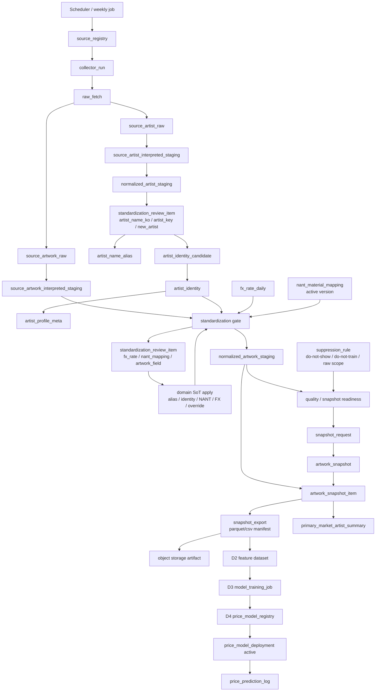
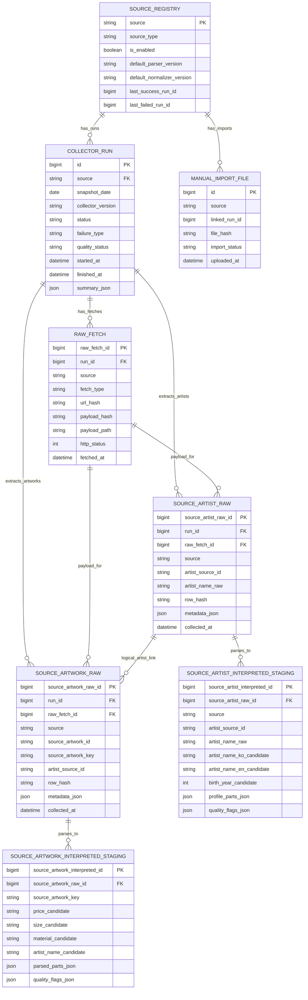
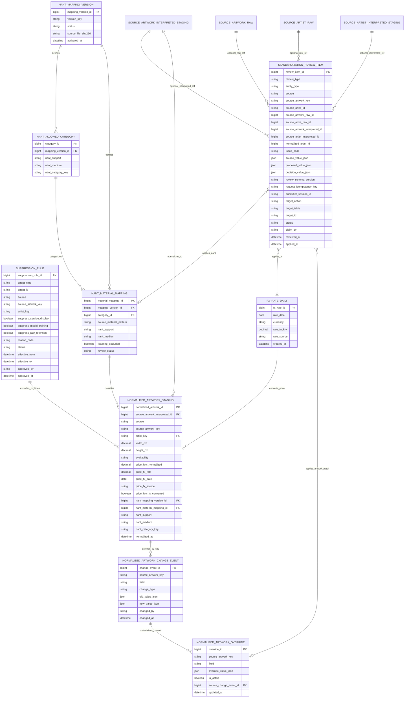
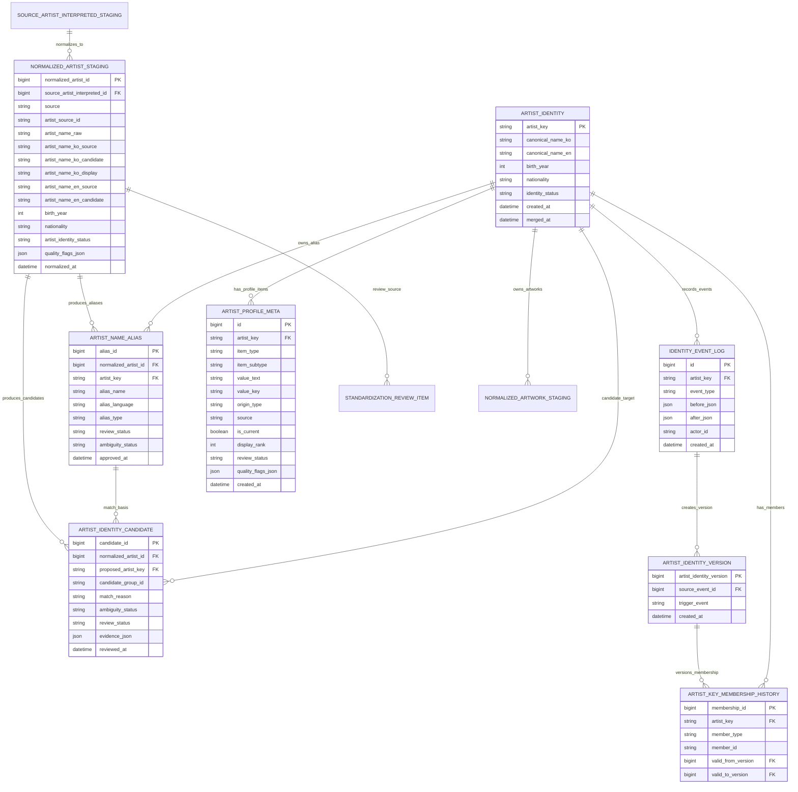
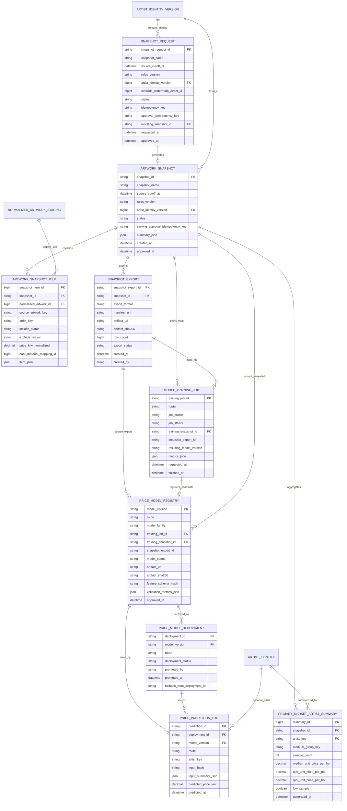

# DB ERD 및 데이터 흐름

작성일: 2026-06-26

## 1. 목적

이 문서는 작품 가격 데이터 플랫폼의 전체 DB 구조를 ERD 관점에서 요약하고, 수집 데이터가 표준화 검수, snapshot/export, 후속 모델 운영으로 흐르는 순서를 한곳에서 확인하기 위한 문서다.

상세 컬럼과 제약의 단일 기준은 아래 문서를 따른다.

- [MySQL 적재 기획](periodic_raw_collection_mysql_plan_20260623.md)
- [수집 분해/표준화 컬럼 요약](standardized_columns_summary_20260626.md)
- [주기 수집 운영 문서](weekly_crawler_mysql_operation_plan_20260624.md)
- [사용자 / 어드민 API 기획](user_admin_api_plan_20260625.md)
- [NANT 재료(지지체/매체) 분류 기준](nant_material_classification_criteria_20260626.md)
- [모델 학습과 운영 모델 변경 수명주기](model_training_deployment_lifecycle_20260626.md)

## 2. 핵심 원칙

- raw 계층은 append-only다. 원천 HTML/API/JSON/CSV 응답과 원천 row는 수정하지 않고 새 run으로 다시 수집한다.
- interpreted staging은 raw에서 명시된 값을 분해한 후보 계층이다. 원천에 없는 값을 추정해 채우지 않는다.
- `standardization_review_item`은 최종 SoT가 아니라 검수 일감 큐다. 승인 결과는 각 도메인 SoT에 apply한 뒤 normalizer를 다시 실행한다.
- `normalized_artwork_staging`은 작품 표준화 완료 row다. 확정 active `artist_key`, KRW 환산값, NANT 분류 결과가 해결된 작품만 들어간다.
- 작품 표준화 완료 후 `artist_key`, 가격 환산, NANT 값을 사후 UPDATE로 채우지 않는다. 재처리가 필요하면 새 normalized row 또는 새 snapshot을 만든다.
- NANT 학습 제외 여부는 작품 row에 중복 저장하지 않는다. `nant_material_mapping.learning_excluded`를 snapshot 후보 query에서 조인해 판단한다.
- 개인정보/삭제 요청, do-not-show, do-not-train 기준은 `suppression_rule`이 SoT다. snapshot/export와 사용자 노출 query는 이 테이블을 반드시 조인한다.
- 작가 최종 키는 `artist_identity`가 SoT다. 작가 프로필과 현재 표시값은 `artist_profile_meta`의 `is_current`/`display_rank`로 관리한다.
- 신규 작가 후보 큐는 별도 `new_artist_candidate` 테이블이 아니라 `standardization_review_item(review_type=new_artist)`로 구현한다.
- snapshot export는 단순 파일명이 아니라 `snapshot_export` row와 manifest/hash로 관리한다.
- D1 범위는 수집, 표준화 검수, snapshot/export까지다. feature generation, model training/import, registry/deployment는 D2~D4에서 연결한다.

## 3. 레이어별 테이블

| 레이어 | 주요 테이블 | 역할 |
|---|---|---|
| 원천/실행 | `source_registry`, `collector_run`, `manual_import_file` | 원천 설정, 수집 실행, 수동 import 파일 관리 |
| raw 보존 | `raw_fetch`, `source_artwork_raw`, `source_artist_raw` | 응답 payload와 원천 작품/작가 row 보존 |
| 원천 분해 | `source_artwork_interpreted_staging`, `source_artist_interpreted_staging` | 원천 문자열에서 작품/작가 후보값 분리 |
| 표준화 검수 | `standardization_review_item` | `artist_name_ko`, `artist_key`, `new_artist`, `nant_mapping`, `fx_rate`, `artwork_field`, `profile_meta` 검수 큐 |
| 작품 표준화 | `normalized_artwork_staging`, `normalized_artwork_override`, `normalized_artwork_change_event` | 학습 직전 작품 row, 작품 필드 override 현재값, append-only 변경 이력 |
| 작가 표준화 | `normalized_artist_staging`, `artist_name_alias`, `artist_identity_candidate`, `artist_identity` | 작가명/alias, 동명이인 후보, 최종 `artist_key` 관리 |
| 작가 메타 | `artist_profile_meta` | 확정 작가의 학력/전시/소개/SNS/현재 표시값 항목 단위 관리 |
| identity 이력 | `identity_event_log`, `artist_identity_version`, `artist_key_membership_history` | 신규 생성/연결/merge/un-merge 이력과 snapshot용 identity 버전 고정 |
| 기준값 | `fx_rate_daily`, `nant_mapping_version`, `nant_allowed_category`, `nant_material_mapping` | 환율, NANT 허용 조합, NANT mapping, 학습 제외 기준 |
| 거버넌스/억제 | `suppression_rule` | 서비스 노출 차단, 학습 제외, raw 보존/삭제 요청 scope 관리 |
| snapshot/export | `snapshot_request`, `artwork_snapshot`, `artwork_snapshot_item`, `snapshot_export`, `primary_market_artist_summary` | snapshot 요청/승인, 포함/제외 row 고정, export manifest, 1차 시장 카드 집계 |
| 모델 운영 | `model_training_job`, `price_model_registry`, `price_model_deployment`, `price_prediction_log` | D3/D4 모델 학습/import, registry, active deployment, 예측 로그 |

## 4. 데이터 흐름도

## 5. ERD - 수집/raw/staging

`SOURCE_ARTIST_RAW -> SOURCE_ARTWORK_RAW` 관계는 같은 `source + artist_source_id` 기준의 논리 관계다. 모든 원천이 상세 작가 row를 제공하지 않으므로 D1에서는 물리 FK 필수값으로 강제하지 않고, 값이 있을 때 연결 검증과 조회 최적화에 사용한다.

## 6. ERD - 표준화 검수, 작품 표준화, 기준값

검수 큐 적용 원칙:

- `standardization_review_item`의 `review_type=new_artist`가 신규 작가 후보 큐다.
- `standardization_review_item`의 승인값은 최종 기준값이 아니다. apply job이 `target_table`에 반영해야 한다.
- `nant_mapping` 승인 결과는 active mapping row 직접 수정이 아니라 draft mapping 보강 후 version validation/activate 흐름으로 반영한다.
- `artwork_field` 승인 결과는 `normalized_artwork_override`와 `normalized_artwork_change_event`에 남긴다.
- `review_type`별 필수 필드와 `decision_value_json` schema는 OpenAPI/fixture에서 고정한다. `new_artist`처럼 사용자 제출에서 온 큐 항목은 `request_idempotency_key`와 `submitter_session_id`를 남겨 중복 제출과 남용 추적이 가능해야 한다.

## 7. ERD - 작가 identity / alias / profile

작가 identity 결정 순서:

1. `source + artist_source_id`에 기존 active `artist_key` 연결이 있으면 자동 연결 후보로 본다.
2. 기존 연결이 없으면 승인 alias, 생년, 국적, 활동지, 원천 URL을 근거로 `artist_identity_candidate`를 만든다.
3. 자동 확정 조건을 만족하지 못하거나 동명이인 가능성이 있으면 `standardization_review_item(review_type=artist_key)`에 보류한다.
4. 기존 후보가 없고 최소 식별값과 작품 연결 정보가 있으면 `standardization_review_item(review_type=new_artist)`에 보류한다.
5. 데이터 관리자 승인 후에만 `artist_identity.artist_key`를 생성하거나 기존 key에 연결한다.
6. 신규 생성/연결/merge/un-merge는 `identity_event_log`와 `artist_identity_version`/`artist_key_membership_history`로 남긴다.

alias 중복 방지 기준:

- 후보 alias는 같은 `normalized_artist_id` 안에서 `(alias_name, alias_language)`가 중복되지 않게 한다.
- 승인 alias는 같은 `artist_key` 안에서 `(alias_name, alias_language, alias_type)`이 중복되지 않게 한다.
- 서로 다른 `artist_key`에 같은 alias가 걸릴 수 있으면 자동 병합하지 않고 `ambiguity_status=ambiguous` 또는 `needs_review`로 둔다.

## 8. ERD - snapshot / export / model lifecycle

snapshot/export 경계:

- `snapshot_request`는 생성 요청/승인 워크플로우다.
- `artwork_snapshot`은 생성된 snapshot 산출물이다. `generated`는 생성 완료, `approved`는 서빙/학습 기준으로 승인된 상태다.
- `artwork_snapshot_item`은 `normalized_artwork_staging` 값을 snapshot 기준으로 복사해 고정한다.
- `snapshot_export`는 parquet/CSV export 산출물의 manifest, object URI, row count, hash를 고정한다. `model_training_job`과 `price_model_registry`의 `snapshot_export_id`는 이 테이블을 참조한다.
- `primary_market_artist_summary`는 approved snapshot 기준으로 만든 사용자 1차 시장 카드 집계다. 원천 사이트명, 원천 URL, 원천 작품 ID는 포함하지 않는다.
- D1은 `artwork_snapshot`과 export manifest 생성까지다.
- D2는 feature dataset/contract 고정, D3는 학습/import job, D4는 registry/deployment/version 적용이다.

## 9. 개발 착수 시 FK/구현 주의사항

| 주제 | 기준 |
|---|---|
| 안정 작품 키 | `source_artwork_key = source + source_artwork_id`. 모든 job/API가 동일 합성 규칙을 사용한다 |
| 안정 작가 멤버 키 | `member_id = source + artist_source_id`. `artist_key_membership_history`에서 as-of 멤버십을 고정한다 |
| 신규 작가 후보 | 별도 `new_artist_candidate` 테이블이 아니라 `standardization_review_item(review_type=new_artist)`를 사용한다 |
| 표준화 완료 조건 | `normalized_artwork_staging.artist_key`, KRW 가격 환산, NANT mapping이 해결된 row만 완료 row로 생성한다 |
| NANT 학습 제외 | `nant_material_mapping.learning_excluded` 조인으로 판단한다. 작품 row에 중복 플래그를 만들지 않는다 |
| suppression | `suppression_rule`을 서비스 노출, snapshot/export, 모델 학습 제외 query에 모두 조인한다 |
| 작품 patch | normalized row 직접 수정 금지. `normalized_artwork_override` + `normalized_artwork_change_event`를 사용한다 |
| 작가명/alias | `artist_name_alias`가 승인 alias SoT다. CSV/seed는 초기 import 또는 참고 자료다 |
| 작가 프로필 현재값 | 별도 `artist_profile_current` 테이블을 만들지 않는다. `artist_profile_meta.is_current`/`display_rank`로 조회한다 |
| snapshot 재현성 | `rules_version`, `artist_identity_version`, `override_watermark_event_id`, NANT mapping version, FX 기준을 manifest에 남긴다 |
| 모델 운영 | 운영 모델 여부는 `price_model_deployment.deployment_status=active`가 단일 기준이다 |

## 10. D1 구현 범위

D1에서 필수 구현하는 ERD 범위:

- `source_registry`
- `collector_run`
- `raw_fetch`
- `source_artwork_raw`
- `source_artist_raw`
- `source_artwork_interpreted_staging`
- `source_artist_interpreted_staging`
- `suppression_rule`
- `standardization_review_item`
- `normalized_artist_staging`
- `artist_name_alias`
- `artist_identity_candidate`
- `artist_identity`
- `identity_event_log`
- `artist_identity_version`
- `artist_key_membership_history`
- `artist_profile_meta`
- `fx_rate_daily`
- `nant_mapping_version`
- `nant_allowed_category`
- `nant_material_mapping`
- `normalized_artwork_staging`
- `normalized_artwork_change_event`
- `normalized_artwork_override`
- `snapshot_request`
- `artwork_snapshot`
- `artwork_snapshot_item`
- `snapshot_export`
- `primary_market_artist_summary`

D1에서 제외하고 D2~D4에서 구현하는 ERD 범위:

- feature dataset/feature contract 물리 산출물
- `model_training_job`
- `price_model_registry`
- `price_model_deployment`
- `price_prediction_log`
- 운영 feature store / serving adapter 상세 스키마
